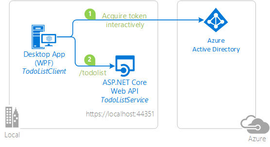

# Calling an ASP.NET Core Web API from a WPF application using Azure AD V2


## About this sample

### Scenario

You expose a Web API and you want to protect it so that only authenticated user can access it. You want to enable authenticated users with both work and school accounts
or Microsoft personal accounts (formerly live account) to use your Web API.

An on-demand video was created for the Build 2018 event, featuring this scenario and this sample. See the video [Building Web API Solutions with Authentication](https://channel9.msdn.com/Events/Build/2018/THR5000), and the associated [PowerPoint deck](http://video.ch9.ms/sessions/c1f9c808-82bc-480a-a930-b340097f6cc1/BuildWebAPISolutionswithAuthentication.pptx)

### Overview

This sample presents a Web API running on ASP.NET Core 2.0, protected by Azure AD OAuth Bearer Authentication. The Web API is exercised by a .NET Desktop WPF application.
The .Net application uses the Active Directory Authentication Library [MSAL.NET](https://github.com/AzureAD/microsoft-authentication-library-for-dotnet) to obtain a JWT access token through the [OAuth 2.0](https://docs.microsoft.com/en-us/azure/active-directory/develop/active-directory-protocols-oauth-code) protocol. The access token is sent to the ASP.NET Core Web API, which authenticates the user using the ASP.NET JWT Bearer Authentication middleware.



> This sample is very similar to the [active-directory-dotnet-native-aspnetcore](https://github.com/Azure-Samples/active-directory-dotnet-native-aspnetcore) sample except that that one is for the Azure AD V1 endpoint
> and the token is acquired using [ADAL.NET](https://github.com/AzureAD/azure-activedirectory-library-for-dotnet), whereas this sample is for the V2 endpoint, and the token is acquired using [MSAL.NET](https://github.com/AzureAD/microsoft-authentication-library-for-dotnet). The Web API was also modified to accept both V1 and V2 tokens.

### User experience with this sample

The Web API (TodoListService) maintains an in-memory collection of to-do items per authenticated user. Several applications signed-in under the same identities share the same to-do list.

The WPF application (TodoListClient) enables a user to:

- Sign in. The first time a user signs in, a consent screen is presented letting the user consent for the application accessing the TodoList Service and the Azure Active Directory.
- When the user has signed-in, the user sees the list of to-do items exposed by Web API for the signed-in identity
- The user can add more to-do items by clicking on *Add item* button.

Next time a user runs the application, the user is signed-in with the same identity as the application maintains a cache on disk. Users can clear the cache (which will also have the effect of signing them out)


## How to run this sample

### Pre-requisites

- Install .NET Core for Windows by following the instructions at [dot.net/core](https://dot.net/core), which will include [Visual Studio 2017](https://aka.ms/vsdownload).
- An Internet connection
- An Azure Active Directory (Azure AD) tenant. For more information on how to get an Azure AD tenant, see [How to get an Azure AD tenant](https://azure.microsoft.com/en-us/documentation/articles/active-directory-howto-tenant/)
- A user account in your Azure AD tenant, or a Microsoft personal account

### Step 1:  Clone or download this repository

From your shell or command line:

```Shell
git clone https://github.com/Azure-Samples/active-directory-dotnet-native-aspnetcore-v2.git
cd "1. Desktop app calls Web API"
```

or download and exact the repository .zip file.

> Given that the name of the sample is pretty long, and so are the name of the referenced NuGet packages, you might want to clone it in a folder close to the root of your hard drive, to avoid file size limitations on Windows.

### Step 2:  Register the sample with your Azure Active Directory tenant

There are two projects in this sample. Each needs to be separately registered in your Azure AD tenant. To register these projects, you can:

- either follow the steps in the paragraphs below ([Step 2](#step-2--register-the-sample-with-your-azure-active-directory-tenant) and [Step 3](#step-3--configure-the-sample-to-use-your-azure-ad-tenant))
- or use PowerShell scripts that:
  - **automatically** create for you the Azure AD applications and related objects (passwords, permissions, dependencies)
  - modify the Visual Studio projects' configuration files.

If you want to use this automation, read the instructions in [App Creation Scripts](./AppCreationScripts/AppCreationScripts.md)
Then, after you ran the scripts, as those don't create yet apps for Azure AD v2.0, be sure to follow the manual steps:
- edit the manifest of both applications to ensure `"signInAudience": "AzureADandPersonalMicrosoftAccount"`
- edit the manifest of the server application to ensure: `"accessTokenAcceptedVersion": 2` and `"signInAudience": "AzureADandPersonalMicrosoftAccount"`

To get directly to the portal, you can navigate to the links in the [AppCreationScripts\createdApps.html](AppCreationScripts\createdApps.html) file created by the scripts

#### Choose the Azure AD tenant where you want to create your applications

As a first step you'll need to:

1. Sign in to the [Azure portal](https://portal.azure.com) using either a work or school account or a personal Microsoft account.
1. If your account gives you access to more than one tenant, select your account in the top right corner, and set your portal session to the desired Azure AD tenant
   (using **Switch Directory**).
1. In the left-hand navigation pane, select the **Azure Active Directory** service, and then select **App registrations (Preview)**.

#### Register the service app (TodoListService)

1. In **App registrations (Preview)** page, select **New registration**.
1. When the **Register an application page** appears, enter your application's registration information:
   - In the **Name** section, enter a meaningful application name that will be displayed to users of the app, for example `TodoListService`.
   - In the **Supported account types** section, select **Accounts in any organizational directory and personal Microsoft accounts (e.g. Skype, Xbox, Outlook.com)**.
   - In the Redirect URI (optional) section, select **Web** in the combo-box.
   - For the *Redirect URI*, enter the base URL for the sample. By default, this sample uses `https://localhost:44351/`.
   - Select **Register** to create the application.

1. On the app **Overview** page, find the **Application (client) ID** value and record it for later. You'll need it to configure the Visual Studio configuration file for this project (`ClientId` in TodoListService\appsettings.json).
1. In the list of pages for the app, select **Expose an API**
   - Select **Add a scope**
   - accept the proposed Application ID URI (api://{clientId}) by selecting **Save and Continue**
   - Enter the following parameters
     - for **Scope name** use `access_as_user`
     - Keep **Admins and users** for **Who can consent**
     - in **Admin consent display name** type `Access TodoListService as a user`
     - in **Admin consent description** type `Accesses the TodoListService Web API as a user`
     - in **User consent display name** type `Access TodoListService as a user`
     - in **User consent description** type `Accesses the TodoListService Web API as a user`
     - Keep **State** as **Enabled**
     - Select **Add scope**
1. In the list of pages, select **Manifest**
   - in the manifest, search for "accessTokenAcceptedVersion", and replace **null** by **2**. This property lets Azure AD know that the
     Web API accepts v2.0 tokens

> Important: it's up to the Web API to decide which generation of token (v1.0 or v2.0) it accepts.

#### Register the client app (TodoListClient)

1. In **App registrations (Preview)** page, select **New registration**.
1. When the **Register an application page** appears, enter your application's registration information:
   - In the **Name** section, enter a meaningful application name that will be displayed to users of the app, for example `TodoListClient`.
   - In the **Supported account types** section, select **Accounts in any organizational directory and personal Microsoft accounts (e.g. Skype, Xbox, Outlook.com)**.
   - Select **Register** to create the application.
1. On the app **Overview** page, find the **Application (client) ID** value and record it for later. You'll need it to configure the Visual Studio configuration file for this project (`ida:ClientId` in TodoListClient\App.Config).
1. In the list of pages for the app, select **Authentication**.
   - In the **Redirect URLs** | **Suggested Redirect URLs for public clients (mobile, desktop)** section, check **urn:ietf:wg:oauth:2.0:oob**
 1. Select **Save**.
1. In the list of pages for the app, select **API permissions**
   - Click the **Add a permission** button and then,
   - Ensure that the **My APIs** tab is selected
   - In the list of APIs, select the API `TodoListService`.
   - In the **Delegated permissions** section, ensure that the right permissions are checked: **access_as_user**. Use the search box if necessary.
   - Select the **Add permissions** button

### Step 3:  Configure the sample to use your Azure AD tenant

#### Choose which users account to sign in

By default the sample is configured to enable users to sign in with any work and school accounts (AAD) or Microsoft Personal accounts (formerly live account).
This is because `ida:Tenant` has the value of `common`.

##### Important note

`common` is **not** a proper tenant. It's just a **convention** to express that the accepted tenants are any Work and School organizations, or Personal Microsoft account (consumer accounts).
Accepted tenants can have the following values:

Value | Meaning
----- | --------
`common` | users can sign in with any Work and School account, or Microsoft Personal account
`organizations` |  users can sign in with any Work and School account
`consumers` |  users can sign in with a Microsoft Personal account
a GUID or domain name | users can only sign in with an account for a specific organization described by its tenant ID (GUID) or domain name

#### Configure the TodoListService C# project

1. Open the solution in Visual Studio.
1. In the *TodoListService* project, open the `appsettings.json` file.
1. Find the `ClientId` property and replace the value with the Application ID (Client ID) property of the *TodoListService-v2* application, that you registered earlier.
1. [Optional] if you want to limit sign-in to users in your organization, also update the following
- The `Domain` property, replacing the existing value with your AAD tenant domain, for example, contoso.onmicrosoft.com.
- The `TenantId` property replacing the existing value with the Tenant ID.

#### Configure the TodoListClient C# project

1. In the TodoListClient project, open `App.config`.
1. Find the app key `ida:ClientId` and replace the value with the ApplicationID (Client ID) for the *TodoListClient-v2* app copied from the app registration page.
1. Find the app key `todo:TodoListScope` and replace the value with the scope of the TodoListService-v2 application copied from the app registration in the **Expose an API** tab (of the form ``api://<Application ID of service>/access_as_user`` if you followed the instructions above)
1. [Optional] If you want your application to work only in your organization (only in your tenant) you'll also need to Find the app key `ida:Tenant` and replace the value with your AAD Tenant ID (GUID). Alternatively you can also use your AAD tenant Name (for example, contoso.onmicrosoft.com)
1. [Optional] If you changed the default URL for your service application, find the app key `todo:TodoListBaseAddress` and replace the value with the base address of the TodoListService project.

### Step 4: Run the sample

Clean the solution, rebuild the solution, and run it.  You might want to go into the solution properties and set both projects as startup projects, with the service project starting first.

When you start the Web API from Visual Studio, depending on the browser you use, you'll get:

- an empty web page (case with Microsoft Edge)
- or an error HTTP 401 (case with Chrome)

This behavior is expected as you are not authenticated. The WPF application will be authenticated, so it will be able to access the Web API.

Explore the sample by signing in into the TodoList client, adding items to the To Do list, removing the user account (clearing the cache), and starting again.  As explained, if you stop the application without removing the user account, the next time you run the application, you won't be prompted to sign in again. That is because the sample implements a persistent cache for MSAL, and remembers the tokens from the previous run.

NOTE: Remember, the To-Do list is stored in memory in this `TodoListService-v2` sample. Each time you run the TodoListService API, your To-Do list will get emptied.

## How was the code created

### Code for the service

The code for the service was created in the following way:

#### Create the web api using the ASP.NET templates

```Text
md TodoListService
cd TodoListService
dotnet new webapi -au=SingleOrg
```

#### Add a model (TodoListItem) and modify the controller

In the TodoListService project, add a folder named `Models` and then a file named `TodoItem.cs` with the following content:

```CSharp
namespace TodoListService.Models
{
    public class TodoItem
    {
        public string Owner { get; set; }
        public string Title { get; set; }
    }
}
```

Under the `Controllers` folder, rename the file `ValuesController.cs` to `TodoListController.cs` and copy the following content in this file:

```CSharp
using Microsoft.AspNetCore.Authorization;
using Microsoft.AspNetCore.Mvc;
using System.Collections.Concurrent;
using System.Collections.Generic;
using System.Linq;
using System.Security.Claims;
using TodoListService.Models;

namespace TodoListService.Controllers
{
    [Authorize]
    [Route("api/[controller]")]
    public class TodoListController : Controller
    {
        static ConcurrentBag<TodoItem> todoStore = new ConcurrentBag<TodoItem>();

        [HttpGet]
        public IEnumerable<TodoItem> Get()
        {
            string owner = (User.FindFirst(ClaimTypes.NameIdentifier))?.Value;
            return todoStore.Where(t => t.Owner == owner).ToList();
        }

        [HttpPost]
        public void Post([FromBody]TodoItem Todo)
        {
            string owner = (User.FindFirst(ClaimTypes.NameIdentifier))?.Value;
            todoStore.Add(new TodoItem { Owner = owner, Title = Todo.Title });
        }
    }
}
```

This code gets the todo list items associated with their owner, which is the identity of the user using the Web API. It also adds todo list items associated with the same user.
There is no persistence as implementing token persistence on the service side would be beyond the scope of this sample

#### Add a AadIssuerValidator file under a new Extensions folder

1. Create a new folder named `Extensions`
2. Add a new file named `AadIssuerValidator.cs`with the following content:

```CSharp
using Microsoft.IdentityModel.Tokens;
using System.Collections.Generic;
using System.IdentityModel.Tokens.Jwt;
using System.Linq;

namespace Microsoft.AspNetCore.Authentication
{
    public static class AadIssuerValidator
    {
        /// <summary>
        /// Validate the issuer for multi-tenant applications of various audience (Work and School account, or Work and School accounts +
        /// Personal accounts)
        /// </summary>
        /// <param name="issuer">Issuer to validate (will be tenanted)</param>
        /// <param name="securityToken">Received Security Token</param>
        /// <param name="validationParameters">Token Validation parameters</param>
        /// <remarks>The issuer is considered as valid if it has the same http scheme and authority as the
        /// authority from the configuration file, has a tenant Id, and optionally v2.0 (this web api
        /// accepts both V1 and V2 tokens).
        /// Authority aliasing is also taken into account</remarks>
        /// <returns>The <c>issuer</c> if it's valid, or otherwise <c>SecurityTokenInvalidIssuerException</c> is thrown</returns>
        public static string ValidateAadIssuer(string issuer, SecurityToken securityToken, TokenValidationParameters validationParameters)
        {
            JwtSecurityToken jwtToken = securityToken as JwtSecurityToken;
            if (jwtToken == null)
            {
                throw new SecurityTokenInvalidIssuerException("Expecting a JWT Token from Azure Active Directory.");
            }

            // Extracting the tenant ID
            string tenantId = jwtToken.Claims.FirstOrDefault(c => c.Type == "tid")?.Value;
            if (jwtToken == null)
            {
                throw new SecurityTokenInvalidIssuerException("Expecting a tid claim from Azure Active Directory.");
            }

            // Build the valid tenanted issuers
            List<string> allValidIssuers = new List<string>();

            IEnumerable<string> validIssuers = validationParameters.ValidIssuers;
            if (validIssuers != null)
            {
                allValidIssuers.AddRange(validIssuers.Select(i => TenantedIssuer(i, tenantId)));
            }

            string validIssuer = validationParameters.ValidIssuer;
            if (validIssuer != null)
            {
                allValidIssuers.Add(TenantedIssuer(validIssuer, tenantId));
            }

            // Consider the aliases (https://login.microsoftonline.com (v2.0 tokens) => https://sts.windows.net (v1.0 tokens) )
            allValidIssuers.AddRange(allValidIssuers.Select(i => i.Replace("https://login.microsoftonline.com", "https://sts.windows.net")).ToArray());

            // Consider tokens provided both by v1.0 and v2.0 issuers
            allValidIssuers.AddRange(allValidIssuers.Select(i => i.Replace("/v2.0", "/")).ToArray());

            if (!allValidIssuers.Contains(issuer))
            {
                throw new SecurityTokenInvalidIssuerException("Issuer does not match the valid issuers");
            }
            else
            {
                return issuer;
            }
        }

        private static string TenantedIssuer(string i, string tenantId)
        {
            return i.Replace("{tenantid}", tenantId);
        }
    }
}
```

This code validates that the issuer of the token sent, by its client, to the Web API, can be trusted. This code enables both v1.0 and v2.0 tokens.

#### Modify the startup.cs file so that the Web API becomes v2.0 multi-tenant app

Make the following changes in the `Startup.cs` file.

Add a using for `Microsoft.AspNetCore.Authentication.JwtBearer`

```CSharp
using Microsoft.AspNetCore.Authentication.JwtBearer;
```

After:

```CSharp
 .AddAzureAdBearer(options => Configuration.Bind("AzureAd", options));
```

Insert the following code

```CSharp
services.Configure<JwtBearerOptions>(AzureADDefaults.JwtBearerAuthenticationScheme, options =>
{
    // This is an Azure AD v2.0 Web API
    options.Authority += "/v2.0";

    // The valid audiences are both the Client ID (options.Audience) and api://{ClientID}
    options.TokenValidationParameters.ValidAudiences = new string[] { options.Audience, $"api://{options.Audience}" };

    // Instead of using the default validation (validating against a single tenant, as we do in line of business apps),
    // we inject our own multitenant validation logic (which even accepts both V1 and V2 tokens)
    options.TokenValidationParameters.IssuerValidator = AadIssuerValidator.ValidateAadIssuer;
});
```

This code makes sure that:
- the tokens are validated with Azure AD v2.0 (the ASP.NET Core 2.1 template is for the moment an Azure AD v1.0 template) 
- the valid audiences are both the ClientID of our Web API (default value of `options.Audience` with the ASP.NET Core template
  and api://{ClientID}
- the issuer is validated (for the multi-tenant case) 

#### Change the App URL

You want to change the launch URL and application URL to match the application
registration:

If you're using Visual Studio 2017:

1. Edit the TodoListService's properties (right click on `TodoListService.csproj`, and choose **Properties**)
1. In the Debug tab:
    1. Check the **Launch browser** field to `https://localhost:44351/api/todolist`
    1. Change the **App URL** field to be `https://localhost:44351` as this URL is the URL registered in the Azure AD application representing the Web API.
    1. Check the **Enable SSL** field

## How to deploy this sample to Azure

This project has one WebApp / Web API project. To deploy it to Azure Web Sites, you'll need to:

- create an Azure Web Site
- publish the Web App / Web APIs to the web site, and
- update its client(s) to call the web site instead of IIS Express.

### Create and publish the `TodoListService` to an Azure Web Site

1. Sign in to the [Azure portal](https://portal.azure.com).
2. Click **Create a resource** in the top left-hand corner, select **Web + Mobile** --> **Web App**, select the hosting plan and region, and give your web site a name, for example, `TodoListService-contoso.azurewebsites.net`.  Click Create Web Site.
3. Once the web site is created, click on it to manage it.  For this set of steps, download the publish profile by clicking **Get publish profile** and save it.  Other deployment mechanisms, such as from source control, can also be used.
4. Switch to Visual Studio and go to the TodoListService project.  Right click on the project in the Solution Explorer and select **Publish**.  Click **Import Profile** on the bottom bar, and import the publish profile that you downloaded earlier.
5. Click on **Settings** and in the `Connection tab`, update the Destination URL so that it is https, for example [https://TodoListService-contoso.azurewebsites.net](https://TodoListService-contoso.azurewebsites.net). Click Next.
6. On the Settings tab, make sure `Enable Organizational Authentication` is NOT selected.  Click **Save**. Click on **Publish** on the main screen.
7. Visual Studio will publish the project and automatically open a browser to the URL of the project.  If you see the default web page of the project, the publication was successful.

### Update the Active Directory tenant application registration for `TodoListService`

1. Navigate to the [Azure portal](https://portal.azure.com).
1. On the top bar, click on your account and under the **Directory** list, choose the Active Directory tenant containing the `TodoListService` application.
1. On the applications tab, select the `TodoListService` application.
1. From the *Settings -> Properties* menu, update the **Home page URL**, to the address of your service, for example [https://TodoListService-contoso.azurewebsites.net](https://TodoListService-contoso.azurewebsites.net). Save the configuration.
1. Add the same URL in the list of values of the *Settings -> Reply URLs* menu

### Update the `TodoListClient` to call the `TodoListService` running in Azure Web Sites

1. In Visual Studio, go to the `TodoListClient` project.
2. Open `TodoListClient\App.Config`.  Only one change is needed - update the `todo:TodoListBaseAddress` key value to be the address of the website you published,
   for example, [https://TodoListService-contoso.azurewebsites.net](https://TodoListService-contoso.azurewebsites.net).
3. Run the client! If you are trying multiple different client types (for example, .Net, Windows Store, Android, iOS) you can have them all call this one published web API.

> NOTE: Remember, the To-Do list is stored in memory in this TodoListService sample. Azure Web Sites will spin down your web site if it is inactive, and your To Do list will get emptied.
Also, if you increase the instance count of the web site, requests will be distributed among the instances. To Do will, therefore, not be the same on each instance.

## Community Help and Support

Use [Stack Overflow](http://stackoverflow.com/questions/tagged/msal) to get support from the community.
Ask your questions on Stack Overflow first and browse existing issues to see if someone has asked your question before.
Make sure that your questions or comments are tagged with [`msal` `dotnet`].

If you find a bug in the sample, please raise the issue on [GitHub Issues](../../issues).

To provide a recommendation, visit the following [User Voice page](https://feedback.azure.com/forums/169401-azure-active-directory).

## Contributing

If you'd like to contribute to this sample, see [CONTRIBUTING.MD](/CONTRIBUTING.md).

This project has adopted the [Microsoft Open Source Code of Conduct](https://opensource.microsoft.com/codeofconduct/). For more information, see the [Code of Conduct FAQ](https://opensource.microsoft.com/codeofconduct/faq/) or contact [opencode@microsoft.com](mailto:opencode@microsoft.com) with any additional questions or comments.

For more information, visit the following links:

- To lean more about the application registration, visit:

  - [Quickstart: Register an application with the Microsoft identity platform (Preview)](https://docs.microsoft.com/en-us/azure/active-directory/develop/quickstart-register-app)
  - [Quickstart: Configure a client application to access web APIs (Preview)](https://docs.microsoft.com/en-us/azure/active-directory/develop/quickstart-configure-app-access-web-apis)
  - [Quickstart: Quickstart: Configure an application to expose web APIs (Preview)](https://docs.microsoft.com/en-us/azure/active-directory/develop/quickstart-configure-app-expose-web-apis)

- To learn more about the code, visit [Conceptual documentation for MSAL.NET](https://github.com/AzureAD/microsoft-authentication-library-for-dotnet/wiki#conceptual-documentation) and in particular:
  - [Acquiring tokens with authorization codes on web apps](https://github.com/AzureAD/microsoft-authentication-library-for-dotnet/wiki/Acquiring-tokens-with-authorization-codes-on-web-apps)
  - [Customizing Token cache serialization](https://github.com/AzureAD/microsoft-authentication-library-for-dotnet/wiki/token-cache-serialization)

- Articles about the Azure AD V2 endpoint [http://aka.ms/aaddevv2](http://aka.ms/aaddevv2), with a focus on:
  - [Azure Active Directory v2.0 and OAuth 2.0 On-Behalf-Of flow](https://docs.microsoft.com/en-us/azure/active-directory/develop/active-directory-v2-protocols-oauth-on-behalf-of)

- [Introduction to Identity on ASP.NET Core](https://docs.microsoft.com/en-us/aspnet/core/security/authentication/identity?view=aspnetcore-2.1&tabs=visual-studio%2Caspnetcore2x)
  - [AuthenticationBuilder](https://docs.microsoft.com/en-us/dotnet/api/microsoft.aspnetcore.authentication.authenticationbuilder?view=aspnetcore-2.0)
  - [Azure Active Directory with ASP.NET Core](https://docs.microsoft.com/en-us/aspnet/core/security/authentication/azure-active-directory/?view=aspnetcore-2.1)
