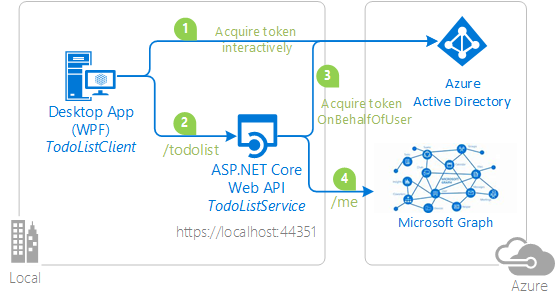

# Sign a user into a Desktop application using Microsoft Identity Platform and call a protected ASP.NET Core Web API, which calls Microsoft Graph on-behalf of the user

[](https://identitydivision.visualstudio.com/IDDP/_build/latest?definitionId=516)

## About this sample

### Table of content
- [About this sample](#about-this-sample)
  - [Scenario](#scenario)
  - [Overview](#overview)
  - [User experience when using this sample](#user-experience-when-using-this-sample)
- [How to run this sample](#how-to-run-this-sample)
  - [Pre-requisites](#pre-requisites)
  - [Step 1:  Clone or download this repository](#step-1-clone-or-download-this-repository)
  - [Step 2:  Register the sample application with your Microsoft Entra tenant](#step-2-register-the-sample-application-with-your-azure-active-directory-tenant)
  - [Step 3: Run the sample](#step-3-run-the-sample)
- [How was the code created](#how-was-the-code-created)
- [How to deploy this sample to Azure](#how-to-deploy-this-sample-to-azure)
- [Community Help and Support](#community-help-and-support)
- [Contributing](#contributing)
- [More information](#more-information)

### Scenario

In this sample, we would protect an ASP.Net Core Web API using the Microsoft Identity Platform. The Web API will be protected using Microsoft Entra ID OAuth Bearer Authorization. The API will support authenticated users with Work and School accounts. Further on the API will also call a downstream API (Microsoft Graph) on-behalf of the signed-in user to provide additional value to its client apps.

### Overview

This sample presents an ASP.NET core Web API, protected by Microsoft Entra ID OAuth Bearer Authorization, that also calls the Microsoft Graph on-behalf of the signed-in user. The Web API is called by a .NET Desktop WPF application.

Both applications use the Microsoft Authentication Library [MSAL.NET](https://github.com/AzureAD/microsoft-authentication-library-for-dotnet) to sign-in user and obtain a JWT access token through the [OAuth 2.0](https://docs.microsoft.com/azure/active-directory/develop/active-directory-protocols-oauth-code) protocol.

The WPF client application:

1. Signs-in users using the MSAL.NET library.
1. Acquires an access token for the Web API
1. Calls the ASP.NET Core Web API by using the access token as a bearer token in the authentication header of the Http request.

The Web API:

1. Authorizes the caller (user) using the ASP.NET JWT Bearer Authorization middleware.
1. Acquires another access token on-behalf-of the signed-in user using the [on-behalf of flow](https://docs.microsoft.com/azure/active-directory/develop/v2-oauth2-on-behalf-of-flow).
1. The Web API then uses this new Access token to call Microsoft Graph.



- Developers who wish to gain good familiarity of programming for Microsoft Graph are advised to go through the [An introduction to Microsoft Graph for developers](https://www.youtube.com/watch?v=EBbnpFdB92A) recorded session.

### User experience when using this sample

The Web API (TodoListService) maintains an in-memory collection of to-do items for each authenticated user. Several applications signed-in under the same identity will share the same to-do list.

The WPF application (TodoListClient) allows a user to:

- Sign-in. The first time a user signs in, a consent screen is presented where the user consents for the application accessing the TodoList Service on their behalf.
- When the user has signed-in, the user is presented with a list of to-do items fetched from the Web API for this signed-in identity.
- The user can add more to-do items by clicking on *Add item* button. As they add items, they see that these items appear with their user name between parenthesis.

Next time a user runs the application, the user is signed-in with the same identity as the WPF application maintains a cache on disk. Users can clear the cache (which will have the effect of them signing out).


## How to run this sample

### Pre-requisites

- [Visual Studio 2019](https://aka.ms/vsdownload) or just the [.NET Core SDK](https://www.microsoft.com/net/learn/get-started)
- An Internet connection
- A Windows machine (necessary if you want to run the app on Windows)
- An OS X machine (necessary if you want to run the app on Mac)
- A Linux machine (necessary if you want to run the app on Linux)
- a Microsoft Entra tenant. For more information on how to get a Microsoft Entra tenant, see [How to get a Microsoft Entra tenant](https://azure.microsoft.com/documentation/articles/active-directory-howto-tenant/)
- A user account in your Microsoft Entra tenant. This sample will not work with a Microsoft account (formerly Windows Live account). Therefore, if you signed in to the [Microsoft admin center](https://portal.azure.com) with a Microsoft account and have never created a user account in your directory before, you need to do that now.

### Step 1:  Clone or download this repository

From your shell or command line:

```Shell
git clone https://github.com/Azure-Samples/active-directory-dotnet-native-aspnetcore-v2.git
cd "2. Web API now calls Microsoft Graph"

```

or download and extract the repository .zip file.

> Given that the name of the sample is quite long, and so are the names of the referenced NuGet packages, you might want to clone it in a folder close to the root of your hard drive, to avoid file size limitations on Windows.

### Step 2:  Register the sample application with your Microsoft Entra tenant

There are two projects in this sample. Each needs to be separately registered in your Microsoft Entra tenant. To register these projects, you can:

- either follow the steps below for manual registration
- or use PowerShell scripts that:
  - **automatically** creates the Microsoft Entra applications and related objects (passwords, permissions, dependencies) for you. Note that this works for Visual Studio only.
  - modify the Visual Studio projects' configuration files.
  
<details>
  <summary>Expand this section if you want to use this automation:</summary>

1. On Windows, run PowerShell and navigate to the root of the cloned directory
1. In PowerShell run:

   ```PowerShell
   Set-ExecutionPolicy -ExecutionPolicy RemoteSigned -Scope Process -Force
   ```

1. Run the script to create your Microsoft Entra application and configure the code of the sample application accordingly.
1. In PowerShell run:

   ```PowerShell
   cd .\AppCreationScripts\
   .\Configure.ps1
   ```

   > Other ways of running the scripts are described in [App Creation Scripts](./AppCreationScripts/AppCreationScripts.md)
   > The scripts also provide a guide to automated application registration, configuration and removal which can help in your CI/CD scenarios.

1. Open the Visual Studio solution and click start to run the code.

</details>

Follow the steps below to manually walk through the steps to register and configure the applications.

#### Choose the Microsoft Entra tenant where you want to create your applications

As a first step you'll need to:

1. Sign in to the [Microsoft admin center](https://portal.azure.com) using either a work or school account or a personal Microsoft account.
1. If your account is present in more than one Microsoft Entra tenant, select your profile at the top right corner in the menu on top of the page, and then **switch directory**.
   Change your portal session to the desired Microsoft Entra tenant.														 

#### Register the service app (TodoListService(ms-identity-dotnet-native-aspnetcore-v2))

1. Navigate to the Microsoft identity platform for developers [App registrations](https://go.microsoft.com/fwlink/?linkid=2083908) page.
1. Select **New registration**.
1. In the **Register an application page** that appears, enter your application's registration information:
   - In the **Name** section, enter a meaningful application name that will be displayed to users of the app, for example `TodoListService(ms-identity-dotnet-native-aspnetcore-v2)`.
   - Under **Supported account types**, select **Accounts in any organizational directory and personal Microsoft accounts (e.g. Skype, Xbox, Outlook.com)**.
   - In the **Redirect URI (optional)** section, select **Web** in the combo-box and enter the following redirect URI: `https://localhost:44351/`.
   - Select **Register** to create the application.
1. In the app's registration screen, find and note the **Application (client) ID**. You use this value in your app's configuration file(s) later in your code.
1. Select **Save** to save your changes.										
1. In the app's registration screen, click on the **Certificates & secrets** blade in the left to open the page where we can generate secrets and upload certificates.
1. In the **Client secrets** section, click on **New client secret**:
   - Type a key description (for instance `app secret`),
   - Select one of the available key durations (**6 months (recommended)**, **3**, **12**, **18**, **24** months or **Custom** ) as per your security concerns.
   - The generated key value will be displayed when you click the **Add** button. Copy the generated value for use in the steps later.
   - You'll need this key later in your code's configuration files. This key value will not be displayed again, and is not retrievable by any other means, so make sure to note it from the Microsoft admin center before navigating to any other screen or blade.
1. In the app's registration screen, click on the **API permissions** blade in the left to open the page where we add access to the APIs that your application needs.
   - Click the **Add a permission** button and then,
   - Ensure that the **Microsoft APIs** tab is selected.
   - In the *Commonly used Microsoft APIs* section, click on **Microsoft Graph**
   - In the **Delegated permissions** section, select the **User.Read** in the list. Use the search box if necessary.
   - Click on the **Add permissions** button at the bottom.
1. In the app's registration screen, select the **Expose an API** blade to the left to open the page where you can declare the parameters to expose this app as an API for which client applications can obtain [access tokens](https://docs.microsoft.com/azure/active-directory/develop/access-tokens) for.
The first thing that we need to do is to declare the unique [resource](https://docs.microsoft.com/azure/active-directory/develop/v2-oauth2-auth-code-flow) URI that the clients will be using to obtain access tokens for this API. To declare an resource URI, follow the following steps:
   - Click `Set` next to the **Application ID URI** to generate a URI that is unique for this app.
   - For this sample, accept the proposed Application ID URI (api://{clientId}) by selecting **Save**.
1. All APIs have to publish a minimum of one [scope](https://docs.microsoft.com/azure/active-directory/develop/v2-oauth2-auth-code-flow#request-an-authorization-code) for the client's to obtain an access token successfully. To publish a scope, follow the following steps:
   - Select **Add a scope** button open the **Add a scope** screen and Enter the values as indicated below:
        - For **Scope name**, use `access_as_user`.
        - Select **Admins and users** options for **Who can consent?**
        - For **Admin consent display name** type `Access TodoListService(ms-identity-dotnet-native-aspnetcore-v2)`
        - For **Admin consent description** type `Allows the app to access TodoListService(ms-identity-dotnet-native-aspnetcore-v2) as the signed-in user.`
        - For **User consent display name** type `Access TodoListService(ms-identity-dotnet-native-aspnetcore-v2)`
        - For **User consent description** type `Allow the application to access TodoListService(ms-identity-dotnet-native-aspnetcore-v2) on your behalf.`
        - Keep **State** as **Enabled**
        - Click on the **Add scope** button on the bottom to save this scope.																																					
#### Configure the service app (TodoListService(ms-identity-dotnet-native-aspnetcore-v2)) to use your app registration

Open the project in your IDE (like Visual Studio) to configure the code.
>In the steps below, "ClientID" is the same as "Application ID" or "AppId".

1. Open the `TodoListService\appsettings.json` file
1. Find the app key `Domain` and replace the existing value with your Microsoft Entra tenant name.
1. Find the app key `TenantId` and replace the existing value with your Microsoft Entra tenant ID.
1. Find the app key `ClientId` and replace the existing value with the application ID (clientId) of the `TodoListService(ms-identity-dotnet-native-aspnetcore-v2)` application copied from the Microsoft admin center.
1. Find the app key `ClientSecret` and replace the existing value with the key you saved during the creation of the `TodoListService(ms-identity-dotnet-native-aspnetcore-v2)` app, in the Microsoft admin center.

#### Register the client app (TodoListClient(ms-identity-dotnet-native-aspnetcore-v2))

1. Navigate to the Microsoft identity platform for developers [App registrations](https://go.microsoft.com/fwlink/?linkid=2083908) page.
1. Select **New registration**.
1. In the **Register an application page** that appears, enter your application's registration information:
   - In the **Name** section, enter a meaningful application name that will be displayed to users of the app, for example `TodoListClient(ms-identity-dotnet-native-aspnetcore-v2)`.
   - Under **Supported account types**, select **Accounts in any organizational directory and personal Microsoft accounts (e.g. Skype, Xbox, Outlook.com)**.
1. Select **Register** to create the application.
1. In the app's registration screen, find and note the **Application (client) ID**. You use this value in your app's configuration file(s) later in your code.
1. In the app's registration screen, select **Authentication** in the menu.
   - If you don't have a platform added, select **Add a platform** and select the **Public client (mobile & desktop)** option.
   - In the **Redirect URIs** | **Suggested Redirect URIs for public clients (mobile, desktop)** section, select **https://login.microsoftonline.com/common/oauth2/nativeclient**																																												
1. Select **Save** to save your changes.
1. In the app's registration screen, click on the **API permissions** blade in the left to open the page where we add access to the APIs that your application needs.
   - Click the **Add a permission** button and then,
   - Ensure that the **My APIs** tab is selected.
   - In the list of APIs, select the API `TodoListService(ms-identity-dotnet-native-aspnetcore-v2)`.
   - In the **Delegated permissions** section, select the **access_as_user** in the list. Use the search box if necessary.
   - Click on the **Add permissions** button at the bottom.

> Important. Even if you declared the permission in the application registration to be (middle-tier)/**access_as_user**, in the code, you will need to acquire a token for (middle-tier)/**.default** in order to let the user consent to the downstream API (Graph) as well as the TodoListService. See [Configure the TodoListClient C# project](https://github.com/Azure-Samples/active-directory-dotnet-native-aspnetcore-v2/blob/master/2.%20Web%20API%20now%20calls%20Microsoft%20Graph/README.md#configure-the-todolistclient-c-project) below

#### Configure the client app (TodoListClient(ms-identity-dotnet-native-aspnetcore-v2)) to use your app registration

Open the project in your IDE (like Visual Studio) to configure the code.
>In the steps below, "ClientID" is the same as "Application ID" or "AppId".

1. Open the `TodoListClient\App.Config` file
1. Find the app key `ida:ClientId` and replace the existing value with the application ID (clientId) of the `TodoListClient(ms-identity-dotnet-native-aspnetcore-v2)` application copied from the Microsoft admin center.
2. Find the app key `todo:TodoListScope` and replace the existing value with ScopeDefault.																													
3. Find the app key `todo:TodoListBaseAddress` and replace the existing value with the base address of the TodoListService(ms-identity-dotnet-native-aspnetcore-v2) project (by default `https://localhost:44351/`).

#### Configure Known Client Applications for service (TodoListService(ms-identity-dotnet-native-aspnetcore-v2))

For a middle tier Web API (`TodoListService(ms-identity-dotnet-native-aspnetcore-v2)`) to be able to call a downstream Web API, the middle tier app needs to be granted the required permissions as well.
However, since the middle tier cannot interact with the signed-in user, it needs to be explicitly bound to the client app in its Microsoft Entra ID registration.
This binding merges the permissions required by both the client and the middle tier Web API and presents it to the end user in a single consent dialog. The user then consent to this combined set of permissions.

To achieve this, you need to add the **Application Id** of the client app, in the Manifest of the Web API in the `knownClientApplications` property. Here's how:

1. In the [Microsoft admin center](https://portal.azure.com), navigate to your `TodoListService(ms-identity-dotnet-native-aspnetcore-v2)` app registration, and select **Manifest** section.
1. In the manifest editor, change the `"knownClientApplications": []` line so that the array contains 
   the Client ID of the client application (`TodoListClient(ms-identity-dotnet-native-aspnetcore-v2)`) as an element of the array.

    For instance:

    ```json
    "knownClientApplications": ["ca8dca8d-f828-4f08-82f5-325e1a1c6428"],
    ```

1. **Save** the changes to the manifest.

### Step 3: Run the sample

Clean the solution, rebuild the solution, and run it. You might want to go into the solution properties and set both projects as startup projects, with the service project starting first.

When you start the Web API from Visual Studio, depending on the browser you use, you'll get:

- an empty web page (with Microsoft Edge)
- or an error HTTP 401 (with Chrome)

This behavior is expected as the browser is not authenticated. The WPF application will be authenticated, so it will be able to access the Web API.

Explore the sample by signing in into the TodoList client, adding items to the To Do list, removing the user account (clearing the cache), and starting again. As explained, if you stop the application without removing the user account, the next time you run the application, you won't be prompted to sign in again. That is because the sample implements a persistent cache for MSAL, and remembers the tokens from the previous run.

NOTE: Remember, the To-Do list is stored in memory in this `TodoListService-v2` sample. Each time you run the TodoListService API, your To-Do list will get emptied.

> [Consider taking a moment to share your experience with us.](https://forms.office.com/Pages/ResponsePage.aspx?id=v4j5cvGGr0GRqy180BHbR73pcsbpbxNJuZCMKN0lURpUNDVNMlg5UlVWVDlVNFhJMUZFRlNEMU5LRiQlQCN0PWcu)

## How was the code created

For details about the way the code to protect the Web API was created, see [How was the code created](../1.%20Desktop%20app%20calls%20Web%20API/README.md#How-was-the-code-created) section, of the README.md file located in the sibling folder named **1. Desktop app calls Web API**.

This section is only about the additional code added to let the Web API call the Microsoft Graph

### Reference MSAL.NET

Calling a downstream API involves getting a token for this API. The Access Token acquisition is achieved by using MSAL.NET.

Reference the `Microsoft.Identity.Client` NuGet package from the TodoListService project.

Add a reference to the `Microsoft.Identity.Web` library. It contains reusable code that you can use in your Web APIs (and web apps)

### Modify the `Startup.cs` file to add a token received by the Web API to the MSAL.NET cache

Update `Startup.cs` file:

- Add a using for `Microsoft.Identity.Client`

- In the `ConfigureServices` method, replace:

  ```CSharp
  services.AddAuthentication(AzureADDefaults.BearerAuthenticationScheme)
          .AddAzureADBearer(options => Configuration.Bind("AzureAd", options));
   ```

  by

  ```csharp
  services.AddMicrosoftIdentityWebApiAuthentication(Configuration)
          .EnableTokenAcquisitionToCallDownstreamApi()
          .AddInMemoryTokenCaches();
  ```

  `AddMicrosoftIdentityWebApiAuthentication` does the following:
  - add the **JwtBearerAuthenticationScheme** (Note the replacement of BearerAuthenticationScheme by JwtBearerAuthenticationScheme)
  - set the authority to be the Microsoft identity platform identity
  - set the audiences to be validated
  - register an issuer validator that accepts issuers from Microsoft Identity Platform clouds.

  The .NET Core "services" that are added are:

  - a token acquisition service leveraging MSAL.NET
  - an in memory token cache

  The implementations of these classes are in the [Microsoft.Identity.Web](https://github.com/AzureAD/microsoft-identity-web) library, and they are designed to be reusable in your applications (Web apps and Web apis).

  `EnableTokenAcquisitionToCallDownstreamApi` subscribes to the `OnTokenValidated` JwtBearerAuthentication event, and in this event, adds the user account into MSAL.NET's user token cache.

  `AddInMemoryTokenCaches` adds an in memory token cache provider, which will cache the Access Tokens acquired for the downstream Web API.

### Modify the TodoListController.cs file to add information on the todo item about its owner

In the `TodoListController.cs` file, the `Post` method is modified by replacing

```CSharp
todoStore.Add(new TodoItem { Owner = owner, Title = Todo.Title });
```

with

```CSharp
User user = _graphServiceClient.Me.Request().GetAsync().GetAwaiter().GetResult();
string title = string.IsNullOrWhiteSpace(user.UserPrincipalName) ? todo.Title : $"{todo.Title} ({user.UserPrincipalName})";
TodoStore.Add(new TodoItem { Owner = owner, Title = title });
```

The work of calling Microsoft Graph to get the owner name is done by `GraphServiceClient`, which is set up by Microsoft Identity Web.

`GraphServiceClient`

- gets an access token for the Microsoft Graph on behalf of the user (leveraging the in-memory token cache, which was added in the `Startup.cs`), and
- calls the Microsoft Graph `/me` endpoint to retrieve the name of the user.


### Handling required interactions with the user (dynamic consent, MFA, etc.)

#### On the Web API side

An interesting piece is how `MicrosoftIdentityWebChallengeUserException` are handled. These exceptions are typically sent by Microsoft Entra ID when there is a need for a user interaction. This can be the case when the user needs to re-sign-in, or needs to grant some additional consent, or to obtain additional claims. For instance, the user might need to do multi-factor authentication required specifically by a specific downstream API. When these exceptions happen, given that the Web API does not have any UI, it needs to challenge the client app passing all the required information, so this client app can handle the interaction with the user.

This sample uses the `ReplyForbiddenWithWwwAuthenticateHeaderAsync` available on the `TokenAcquisition` service (part of Microsoft.Identity.Web library), which uses the HttpResponse to:

- Send an HTTP 403 (Forbidden) to the client app
- Set information in the www-Authenticate header of the HttpResponse with information that would enable a client to get more consent from the user that is:
  - the client ID of our Web API
  - the scopes to request
  - the claims (for conditional access, MFA etc.)

The code for this method is available in [Microsoft.Identity.Web library](https://github.com/AzureAD/microsoft-identity-web/blob/master/src/Microsoft.Identity.Web/TokenAcquisition.cs#L502)

#### On the client side

On the client side, when it calls the Web API and receives a 403 with a www-Authenticate header, the client will call the `HandleChallengeFromWebApi` method, which will

- extract the consent URI from the www-Authenticate header,
- navigate to the consent URI provided by the Web API.

The code for `HandleChallengeFromWebApi` method is available from [TodoListClient\MainWindow.xaml.cs L162-197](https://github.com/Azure-Samples/active-directory-dotnet-native-aspnetcore-v2/blob/4f9a9bc7f08e79f1a3e908cb513c59f1976470da/2.%20Web%20API%20now%20calls%20Microsoft%20Graph/TodoListClient/MainWindow.xaml.cs#L162-L197)

## How to deploy this sample to Azure

See [Readme.md](../5.Deploy-Web-API/README.md) to deploy this sample to Azure.

## Community Help and Support

Use [Stack Overflow](http://stackoverflow.com/questions/tagged/msal) to get support from the community.
Ask your questions on Stack Overflow first and browse existing issues to see if someone has asked your question before.
Make sure that your questions or comments are tagged with [`microsoft-entra-id` `msal` `dotnet`].

If you find a bug in the sample, please raise the issue on [GitHub Issues](../../../issues).

To provide a recommendation, visit the following [User Voice page](https://feedback.azure.com/forums/169401-azure-active-directory).

## Contributing

If you'd like to contribute to this sample, see [CONTRIBUTING.MD](../CONTRIBUTING.md).

This project has adopted the [Microsoft Open Source Code of Conduct](https://opensource.microsoft.com/codeofconduct/). For more information, see the [Code of Conduct FAQ](https://opensource.microsoft.com/codeofconduct/faq/) or contact [opencode@microsoft.com](mailto:opencode@microsoft.com) with any additional questions or comments.

## More information

For more information, see MSAL.NET's conceptual documentation:

- To learn more about the scenario, see [Scenario: Web app that calls web APIs](https://docs.microsoft.com/azure/active-directory/develop/scenario-web-app-call-api-overview)

- To learn more about Microsoft.Identity.Web, see [Microsoft.Identity.Web/README.md](https://github.com/AzureAD/microsoft-identity-web)

- To learn more about the application registration, visit:

  - [Quickstart: Register an application with the Microsoft identity platform](https://docs.microsoft.com/azure/active-directory/develop/quickstart-register-app)
  - [Quickstart: Configure a client application to access web APIs](https://docs.microsoft.com/azure/active-directory/develop/quickstart-configure-app-access-web-apis)
  - [Quickstart: Quickstart: Configure an application to expose web APIs](https://docs.microsoft.com/azure/active-directory/develop/quickstart-configure-app-expose-web-apis)

- To learn more about the code, visit [Conceptual documentation for MSAL.NET](https://github.com/AzureAD/microsoft-authentication-library-for-dotnet/wiki#conceptual-documentation) and in particular:
  - [Acquiring tokens with the on-behalf-of flow](https://github.com/AzureAD/microsoft-authentication-library-for-dotnet/wiki/on-behalf-of)

- Articles about the Microsoft identity platform endpoint [http://aka.ms/Microsoft Entra IDdevv2](http://aka.ms/Microsoft Entra IDdevv2), with a focus on:
  - [identity platform and OAuth 2.0 On-Behalf-Of flow](https://docs.microsoft.com/azure/active-directory/develop/active-directory-v2-protocols-oauth-on-behalf-of)

- [Introduction to Identity on ASP.NET Core](https://docs.microsoft.com/aspnet/core/security/authentication/identity?view=aspnetcore-2.2&tabs=visual-studio%2Caspnetcore2x)
  - [AuthenticationBuilder](https://docs.microsoft.com/dotnet/api/microsoft.aspnetcore.authentication.authenticationbuilder?view=aspnetcore-2.0)
  - [Microsoft Entra ID with ASP.NET Core](https://docs.microsoft.com/aspnet/core/security/authentication/azure-active-directory/?view=aspnetcore-2.2)
