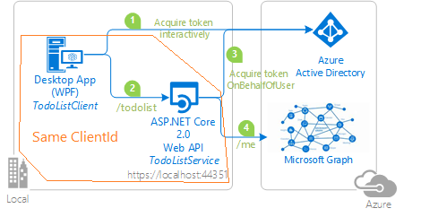
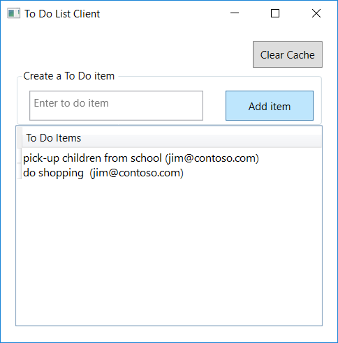

# Sign-in a user with Microsoft Personal accounts, using Microsoft identity platform in a WPF Desktop application and call an ASP.NET Core Web API, which in turn calls Microsoft Graph

[](https://identitydivision.visualstudio.com/IDDP/_build/latest?definitionId=516)

## About this sample

Contrary to the previous chapter, this one shows how to enable users to sign in with a Microsoft personal account

### Table of content

- [About this sample](#About-this-sample)
  - [Scenario](#Scenario)
  - [Overview](#Overview)
  - [User experience when using this sample](#User-experience-when-using-this-sample)
- [How to run this sample](#How-to-run-this-sample)
  - [Step 1:  Clone or download this repository](#step-1--clone-or-download-this-repository)
  - [Step 2:  Register the sample with your Azure Active Directory tenant](#step-2--register-the-sample-with-your-azure-active-directory-tenant)
  - [Step 3:  Configure the sample to use your Azure AD tenant](#step-3--configure-the-sample-to-use-your-azure-ad-tenant)
  - [Step 4:  Run the sample](#step-4-run-the-sample)
  - [Troubleshooting](#Troubleshooting)
- [How was the code created](#How-was-the-code-created)
- [Community Help and Support](#Community-Help-and-Support)
- [Contributing](#Contributing)
- [More information](#More-information)

### Scenario

In the third chapter, we present another pattern where a tightly-knit client and Web API share the same client id(app id) and sign-in users with Microsoft Personal Accounts. In this chapter, the Web API uses the [Microsoft Authentication Library for .NET (MSAL.NET)](https://aka.ms/msal-net) to acquire an [Access Token](https://docs.microsoft.com/azure/active-directory/develop/access-tokens) for Microsoft Graph using the [on-behalf-of](https://aka.ms/msal-net-on-behalf-of) flow.

### Overview

This sample presents a Web API running on ASP.NET Core, protected by Azure AD OAuth Bearer Authorization. A .Net application uses the [Microsoft Authentication Library (MSAL.NET)](https://github.com/AzureAD/microsoft-authentication-library-for-dotnet) to obtain an Access Token through the OAuth 2.0 protocol. The access token is sent to the ASP.NET Core Web API, which authorizes the user using the ASP.NET JWT Bearer Authentication middleware. The Web API then uses the [Microsoft Authentication Library (MSAL.NET)](https://github.com/AzureAD/microsoft-authentication-library-for-dotnet) to acquire an Access Token for Microsoft Graph using the on-behalf-of flow.



- Developers who wish to gain good familiarity of programming for Microsoft Graph are advised to go through the [An introduction to Microsoft Graph for developers](https://www.youtube.com/watch?v=EBbnpFdB92A) recorded session.

### User experience when using this sample

The Web API (TodoListService) maintains an in-memory collection of to-do items per authenticated user. Several applications signed-in under the same identities share the same to-do list.

The WPF application (TodoListClient) allows a user to:

- Sign-in. The first time a user signs in, a consent screen is presented where the user consents for the application accessing the TodoList Service on their behalf.
- When the user has signed-in, the user sees the list of to-do items fetched from the Web API for this signed-in identity.
- The user can add more to-do items by clicking on *Add item* button.

Next time a user runs the application, the user is signed-in with the same identity as the WPF application maintains a cache on disk. Users can clear the cache (which will have the effect of them signing out).



## How to run this sample

### Pre-requisites

To run this sample, you'll need:																														   
- [Visual Studio](https://aka.ms/vsdownload) or just the [.NET Core SDK](https://www.microsoft.com/net/learn/get-started)
- An Internet connection
- A Windows machine (necessary if you want to run the app on Windows)
- An OS X machine (necessary if you want to run the app on Mac)
- A Linux machine (necessary if you want to run the app on Linux)
- An Azure Active Directory (Azure AD) tenant. For more information on how to get an Azure AD tenant, see [How to get an Azure AD tenant](https://azure.microsoft.com/documentation/articles/active-directory-howto-tenant/)
- A user account in your Azure AD tenant. This sample will not work with a Microsoft account (formerly Windows Live account). Therefore, if you signed in to the [Azure portal](https://portal.azure.com) with a Microsoft account and have never created a user account in your directory before, you need to do that now.

### Step 1:  Clone or download this repository

From your shell or command line:

```Shell
git clone https://github.com/Azure-Samples/active-directory-dotnet-native-aspnetcore-v2.git
```
or download and extract the repository .zip file.

> Given that the name of the sample is quiet long, and so are the names of the referenced NuGet packages, you might want to clone it in a folder close to the root of your hard drive, to avoid file size limitations on Windows.

### Step 2:  Register the sample application with your Azure Active Directory tenant

There is one project in this sample. To register it, you can:																												  																																								  

- either follow the steps [Step 2: Register the sample with your Azure Active Directory tenant](#step-2-register-the-sample-with-your-azure-active-directory-tenant) and [Step 3:  Configure the sample to use your Azure AD tenant](#choose-the-azure-ad-tenant-where-you-want-to-create-your-applications)
- or use PowerShell scripts that:
  - **automatically** creates the Azure AD applications and related objects (passwords, permissions, dependencies) for you. Note that this works for Visual Studio only.
  - modify the Visual Studio projects' configuration files.

<details>
  <summary>Expand this section if you want to use this automation:</summary>

1. On Windows, run PowerShell and navigate to the root of the cloned directory
1. In PowerShell run:

   ```PowerShell
   Set-ExecutionPolicy -ExecutionPolicy RemoteSigned -Scope Process -Force
   ```

1. Run the script to create your Azure AD application and configure the code of the sample application accordingly.
1. In PowerShell run:																																																								  
																		 
   ```PowerShell
   cd .\AppCreationScripts\
   .\Configure.ps1
   ```

   > Other ways of running the scripts are described in [App Creation Scripts](./AppCreationScripts/AppCreationScripts.md)
   > The scripts also provide a guide to automated application registration, configuration and removal which can help in your CI/CD scenarios.

1. Open the Visual Studio solution and click start to run the code.
   
</details>

Follow the steps below to manually walk through the steps to register and configure the applications.

#### Choose the Azure AD tenant where you want to create your applications

As a first step you'll need to:

1. Sign in to the [Azure portal](https://portal.azure.com) using either a work or school account or a personal Microsoft account.
1. If your account is present in more than one Azure AD tenant, select your profile at the top right corner in the menu on top of the page, and then **switch directory**.
   Change your portal session to the desired Azure AD tenant.

#### Register the service app (TodoListClient-and-Service)

1. Navigate to the Microsoft identity platform for developers [App registrations](https://go.microsoft.com/fwlink/?linkid=2083908) page.
1. Select **New registration**.
1. In the **Register an application page** that appears, enter your application's registration information:
   - In the **Name** section, enter a meaningful application name that will be displayed to users of the app, for example `TodoListClient-and-Service`.
   - Under **Supported account types**, select **Accounts in any organizational directory and personal Microsoft accounts (e.g. Skype, Xbox, Outlook.com)**.
1. Select **Register** to create the application.
1. In the app's registration screen, find and note the **Application (client) ID**. You use this value in your app's configuration file(s) later in your code.
1. Select **Save** to save your changes.
1. In the app's registration screen, click on the **Certificates & secrets** blade in the left to open the page where we can generate secrets and upload certificates.
1. In the **Client secrets** section, click on **New client secret**:
   - Type a key description (for instance `app secret`),
   - Select one of the available key durations (**In 1 year**, **In 2 years**, or **Never Expires**) as per your security concerns.
   - The generated key value will be displayed when you click the **Add** button. Copy the generated value for use in the steps later.
   - You'll need this key later in your code's configuration files. This key value will not be displayed again, and is not retrievable by any other means, so make sure to note it from the Azure portal before navigating to any other screen or blade.																 
1. In the app's registration screen, click on the **API permissions** blade in the left to open the page where we add access to the APIs that your application needs.
   - Click the **Add a permission** button and then:
   - Ensure that the **Microsoft APIs** tab is selected.
   - In the *Commonly used Microsoft APIs* section, click on **Microsoft Graph**
   - In the **Delegated permissions** section, select the **User.Read** in the list. Use the search box if necessary.
   - Click on the **Add permissions** button at the bottom.
   - Click the **Add a permission** button and then:
   - Ensure that the **My APIs** tab is selected.
   - In the list of APIs, select the API `TodoListClient-and-Service`.
   - In the **Delegated permissions** section, select the **access_as_user** in the list. Use the search box if necessary.
   - Click on the **Add permissions** button at the bottom.
2. In the app's registration screen, click on the **Expose an API** blade to the left to open the page where you can declare the parameters to expose this app as an API for which client applications can obtain [access tokens](https://docs.microsoft.com/azure/active-directory/develop/access-tokens) for.
The first thing that we need to do is to declare the unique [resource](https://docs.microsoft.com/azure/active-directory/develop/v2-oauth2-auth-code-flow) URI that the clients will be using to obtain access tokens for this API. To declare an resource URI, follow the following steps:
   - Click `Set` next to the **Application ID URI** to generate a URI that is unique for this app.
   - For this sample, accept the proposed Application ID URI (api://{clientId}) by selecting **Save**.
1. All APIs have to publish a minimum of one [scope](https://docs.microsoft.com/azure/active-directory/develop/v2-oauth2-auth-code-flow#request-an-authorization-code) for the client's to obtain an access token successfully. To publish a scope, follow the following steps:
   - Select **Add a scope** button open the **Add a scope** screen and Enter the values as indicated below:
        - For **Scope name**, use `access_as_user`.
        - Select **Admins and users** options for **Who can consent?**
        - For **Admin consent display name** type `Access TodoListClient-and-Service`
        - For **Admin consent description** type `Allows the app to access TodoListClient-and-Service as the signed-in user.`
        - For **User consent display name** type `Access TodoListClient-and-Service`
        - For **User consent description** type `Allow the application to access TodoListClient-and-Service on your behalf.`
        - Keep **State** as **Enabled**
        - Click on the **Add scope** button on the bottom to save this scope.

#### Register the client aspect (in the same app)

What **differs from the previous chapter** is that you will use the same application ID for the client part as for the service part

1. On the app **Overview** page, find the **Application (client) ID** value and record it for later. You'll need it to configure the Visual Studio configuration file for this project (`ida:ClientId` in `TodoListClient\App.Config`).
1. From the app's Overview page, select the **Authentication** section.
   - Click **Add a platform** button.
   - Select **Mobile and desktop applications** on the right blade.
   - In the **Redirect URIs** list, check the box next to **https://login.microsoftonline.com/common/oauth2/nativeclient**.
   - Click **Configure**.
1. Select the **API permissions** section
   - Click the **Add a permission** button and then,
   - Ensure that the **My APIs** tab is selected
   - In the list of APIs, select the `TodoListClient-and-Service` API, or the name you entered for the Web API.
   - In the **Delegated permissions** section, ensure that the right permissions are checked: **access_as_user**. Use the search box if necessary.
   - Select the **Add permissions** button

#### Configure the  service app (TodoListClient-and-Service) to use your app registration

Open the project in your IDE (like Visual Studio) to configure the code.
>In the steps below, "ClientID" is the same as "Application ID" or "AppId".										  
1. Open the `TodoListService\appsettings.json` file
2. Find the app key `Domain` and replace the existing value with your Azure AD tenant name.
3. Find the app key `ClientId` and replace the existing value with the application ID (clientId) of the `TodoListClient-and-Service` application copied from the Azure portal.
4. Find the app key `ClientSecret` and replace the existing value with the key you saved during the creation of the `TodoListClient-and-Service` app, in the Azure portal.

#### Configure Authorized client applications for service (TodoListClient-and-Service)

For a middle tier web API (`TodoListClient-and-Service`) to be able to call a downstream web API, the middle tier app needs to be granted the required permissions as well.
However, since the middle tier cannot interact with the signed-in user, it needs to be explicitly bound to the client app in its Azure AD registration.
This binding merges the permissions required by both the client and the middle tier Web API and and presents it to the end user in a single consent dialog. The user than then consent to this combined set of permissions.

To achieve this, you need to add the "Client ID" of the client app, in the manifest of the Web API in the `knownClientApplications` property. Here's how:

1. In the [Azure portal](https://portal.azure.com), navigate to your `TodoListService(ms-identity-dotnet-native-aspnetcore-v2)` app registration, and select **Manifest** section.
1. In the manifest editor, change the `"knownClientApplications": []` line so that the array contains 
   the Client ID of the client application (`TodoListClient(ms-identity-dotnet-native-aspnetcore-v2)`) as an element of the array.

    For instance:

    ```json
    "knownClientApplications": ["ca8dca8d-f828-4f08-82f5-325e1a1c6428"],
    ```
1. **Save** the changes to the manifest.

Open the project in your IDE (like Visual Studio) to configure the code.
1. In the *TodoListClient* project, open `App.config`.
1. Find the app key `ida:ClientId` and replace the value with the ApplicationID (Client ID) for the *TodoListClient-and-Service* app copied from the app registration page.
1. and replace the value with the scope of the TodoListClient-and-Service application copied from the app registration in the **Expose an API** tab, i.e `api://{clientId}/access_as_user`.
1. [Optional] If you changed the default URL for your service application, find the app key `todo:TodoListBaseAddress` and replace the value with the base address of the TodoListService project.
																																																  
### Step 4: Run the sample

Clean the solution, rebuild the solution, and run it.  You might want to go into the solution properties and set both projects as startup projects, with the service project starting first.

When you start the Web API from Visual Studio, depending on the browser you use, you'll get:

- an empty web page (with Microsoft Edge)
- or an error HTTP 401 (with Chrome)

This behavior is expected as the browser is not authenticated. The WPF application will be authenticated, so it will be able to access the Web API.

Explore the sample by signing in into the TodoList client, adding items to the To Do list, removing the user account (clearing the cache), and starting again.  As explained, if you stop the application without removing the user account, the next time you run the application, you won't be prompted to sign in again. That is because the sample implements a persistent cache for MSAL, and remembers the tokens from the previous run.

NOTE: Remember, the To-Do list is stored in memory in this *TodoListService* sample. Each time you run the TodoListService API, your To-Do list will get emptied.

## How was the code created

For details about the code used for protecting a Web API, see [How was the code created](../.%20Web%20API%20now%20calls%20Microsoft%20Graph#How-was-the-code-created) section, of the README.md file located in the sibling folder named **2. Web API now calls Microsoft Graph**.

This section addresses the differences in the code for the Web API calling the Microsoft Graph with Microsoft personal accounts

### Changes to the client side (TodoListClient)

### Web.Config

There is one change in the WebApp.Config, and one thing to check

- The change is that the tenant should be set to `common` in order to let users sign-in with a personal account

    ```XML
    <add key="ida:Tenant" value="common"/>
    ```

- The thing to draw your attention to, is that you now have the same client ID (Application ID) for the client application and the service. This is not usually the case, which is why your attention is especially drawn here.

    ```XML
    <add key="ida:ClientId" value="{clientId}"/>
    <add key="todo:TodoListScope" value="api://{clientId}/access_as_user"/>
    ```

### Have the client let the user consent for the scopes required for the service

The Web API (TodoList service) does not have the possibility of having an interaction with the user (by definition of a Web API), and therefore cannot let the user consent for the scopes it requests. Given that the Web API and the client have the same client ID, it's possible for the client to request a token for the Web API and let the user pre-consent to the scopes requested by the Web API (in this case "user.read")

This is done in `MainWindow.xaml.cs` in the `SignIn` method, by replacing adding to the `AcquireTokenInteractive` call, a modifier `.WithExtraScopesToConsent(new[] { "user.read" })`. See [WithExtraScopeToConsent](https://docs.microsoft.com/en-us/azure/active-directory/develop/scenario-desktop-acquire-token#withextrascopetoconsent) for more details.

```CSharp
public class MainWindow
{
 private async void SignIn(object sender = null, RoutedEventArgs args = null)
 {
  ...
  // Force a sign-in (PromptBehavior.Always), as the ADAL web browser might contain cookies for the current user, and using .Auto
  // would re-sign-in the same user
  var result = await _app.AcquireTokenInteractive(Scopes)
      .WithAccount(accounts.FirstOrDefault())
      .WithPrompt(Prompt.SelectAccount)
      .ExecuteAsync()
      .ConfigureAwait(false);
   ...
 }
}
```

by

```CSharp
public class MainWindow
{
 private async void SignIn(object sender = null, RoutedEventArgs args = null)
 {
  ...
  // Force a sign-in (PromptBehavior.Always), as the ADAL web browser might contain cookies for the current user, and using .Auto
  // would re-sign-in the same user
  var result = await _app.AcquireTokenInteractive(Scopes)
      .WithAccount(accounts.FirstOrDefault())
      .WithPrompt(Prompt.SelectAccount)
      .WithExtraScopesToConsent(new[] { "user.read" })
      .ExecuteAsync()
      .ConfigureAwait(false);
   ...
 }
}
```
### Changes to the service side (TodoListService)

### Startup.cs

The change is to ensure that the Web API allows access to it's own client.

```csharp
public void ConfigureServices(IServiceCollection services)
{      
    services.AddAuthentication(JwtBearerDefaults.AuthenticationScheme)
                .AddMicrosoftWebApi(options =>
    {
        Configuration.Bind("AzureAd", options);
        options.Events = new JwtBearerEvents();
        options.Events.OnTokenValidated = async context =>
        {
            // This check is required to ensure that the Web API only accepts token from it's own client.
            if (context.Principal.Claims.Any(x => (x.Type == "azp" || x.Type == "appid") && x.Value != Configuration["AzureAd:ClientId"]))
            {
                throw new UnauthorizedAccessException("Client is not authorized to access the resource.");
            }
            else
            {
                throw new UnauthorizedAccessException("Application ID claim does not exist for the client.");
            }
        };
    }, 
    options =>
    {
        Configuration.Bind("AzureAd", options);
    })
        .AddMicrosoftWebApiCallsWebApi(Configuration)
        .AddInMemoryTokenCaches();

   ...
}
```

## How to deploy this sample to Azure

See section [How to deploy this sample to Azure](../1.%20Desktop%20app%20calls%20Web%20API/README.md#How-to-deploy-this-sample-to-Azure) in the first part of this tutorial, as the deployment is exactly the same.

## Community Help and Support

Use [Stack Overflow](http://stackoverflow.com/questions/tagged/msal) to get support from the community.
Ask your questions on Stack Overflow first and browse existing issues to see if someone has asked your question before.
Make sure that your questions or comments are tagged with [`msal` `dotnet`].

If you find a bug in the sample, please raise the issue on [GitHub Issues](../../../issues).

To provide a recommendation, visit the following [User Voice page](https://feedback.azure.com/forums/169401-azure-active-directory).

## Contributing

If you'd like to contribute to this sample, see [CONTRIBUTING.MD](../CONTRIBUTING.md).

This project has adopted the [Microsoft Open Source Code of Conduct](https://opensource.microsoft.com/codeofconduct/). For more information, see the [Code of Conduct FAQ](https://opensource.microsoft.com/codeofconduct/faq/) or contact [opencode@microsoft.com](mailto:opencode@microsoft.com) with any additional questions or comments.

## More information

For more information, visit the following links:

- To lean more about the application registration, visit:

  - [Quickstart: Register an application with the Microsoft identity platform (Preview)](https://docs.microsoft.com/en-us/azure/active-directory/develop/quickstart-register-app)
  - [Quickstart: Configure a client application to access web APIs (Preview)](https://docs.microsoft.com/en-us/azure/active-directory/develop/quickstart-configure-app-access-web-apis)
  - [Quickstart: Quickstart: Configure an application to expose web APIs (Preview)](https://docs.microsoft.com/en-us/azure/active-directory/develop/quickstart-configure-app-expose-web-apis)

- To learn more about the code, visit [Conceptual documentation for MSAL.NET](https://github.com/AzureAD/microsoft-authentication-library-for-dotnet/wiki#conceptual-documentation) and in particular:
  - [Acquiring tokens with authorization codes on web apps](https://github.com/AzureAD/microsoft-authentication-library-for-dotnet/wiki/Acquiring-tokens-with-authorization-codes-on-web-apps)
  - [Customizing Token cache serialization](https://github.com/AzureAD/microsoft-authentication-library-for-dotnet/wiki/token-cache-serialization)

- Articles about the Microsoft identity platform endpoint [http://aka.ms/aaddevv2](http://aka.ms/aaddevv2), with a focus on:
  - [Microsoft identity platform and OAuth 2.0 On-Behalf-Of flow](https://docs.microsoft.com/en-us/azure/active-directory/develop/active-directory-v2-protocols-oauth-on-behalf-of)

- [Introduction to Identity on ASP.NET Core](https://docs.microsoft.com/en-us/aspnet/core/security/authentication/identity?view=aspnetcore-2.1&tabs=visual-studio%2Caspnetcore2x)
  - [AuthenticationBuilder](https://docs.microsoft.com/en-us/dotnet/api/microsoft.aspnetcore.authentication.authenticationbuilder?view=aspnetcore-2.0)
  - [Azure Active Directory with ASP.NET Core](https://docs.microsoft.com/en-us/aspnet/core/security/authentication/azure-active-directory/?view=aspnetcore-2.1)
