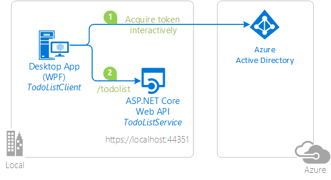

# Sign-in a user with the Microsoft Identity Platform in a console application and call an ASP.NET Core Web API using Proof of Possession token

[](https://identitydivision.visualstudio.com/IDDP/_build/latest?definitionId=516)

## About this sample

### Table of content
- [About this sample](#about-this-sample)
  - [Scenario](#scenario)
  - [Overview](#overview)
  - [User experience when using this sample](#user-experience-when-using-this-sample)
- [How to run this sample](#how-to-run-this-sample)
  - [Step 1: In the downloaded folder](#step-1-in-the-downloaded-folder)
  - [Step 2:  Update the Registration for the sample application with your Azure Active Directory tenant](#step-2-update-the-registration-for-the-sample-application-with-your-azure-active-directory-tenant)
  - [Step 3: Run the sample](#step-3-run-the-sample)
- [How was the code created](#how-was-the-code-created)
- [How to deploy this sample to Azure](#how-to-deploy-this-sample-to-azure)
- [Community Help and Support](#community-help-and-support)
- [Contributing](#contributing)
- [More information](#more-information)
  
### Scenario

In the fourth chapter, we would enhance our protected Web API using Azure AD [Proof of Possession (PoP)](https://github.com/AzureAD/azure-activedirectory-identitymodel-extensions-for-dotnet/wiki/SignedHttpRequest-aka-PoP-(Proof-of-Possession)) Authorization. The access token is protected from being replayed by enabling [Proof of possession tokens](https://tools.ietf.org/html/draft-ietf-oauth-signed-http-request-03#page-9)

### Overview

In This sample, the Web API is called by a .NET console application.

The .Net application uses the Microsoft Authentication Library [MSAL.NET](https://aka.ms/msal-net) to obtain a JWT [Access Token](https://docs.microsoft.com/azure/active-directory/develop/access-tokens) through the [OAuth 2.0](https://docs.microsoft.com/azure/active-directory/develop/active-directory-protocols-oauth-code) protocol. The access token is sent to the ASP.NET Core Web API, which authorizes the user using the ASP.NET JWT Bearer Authentication middleware.



### User experience when using this sample

The Web API (TodoListService) maintains an in-memory collection of to-do items for each authenticated user. Several applications signed-in under the same identity will share the same to-do list.

The desktop application (TodoListClient) allows a user to:

- Enter an item. When the user enters the first item, sign-in screen is displayed. The first time a user signs in, a consent screen is presented where the user consents for the application accessing the TodoList Service on their behalf.
- Each time, the user enters an item, a list of to-do items are fetched from the Web API for this signed-in identity.

Next time a user runs the application, the user is signed-in with the same identity as the console application maintains a cache on disk. Users can clear the cache (which will have the effect of them signing out).


## How to run this sample

### Step 1: In the downloaded folder

From your shell or command line:

```Shell
cd "4.-Console-app-calls-web-API-with-PoP"
```
or download and extract the repository .zip file.

> Given that the name of the sample is quite long, and so are the names of the referenced NuGet packages, you might want to clone it in a folder close to the root of your hard drive, to avoid file size limitations on Windows.

### Step 2:  Update the Registration for the sample application with your Azure Active Directory tenant

#### Update Registration for the service app (TodoListService (active-directory-dotnet-native-aspnetcore-v2)) 

From the app's Overview page, select the **Authentication** section.
   - Remove **Mobile and desktop applications** platform.

#### Configure the client app (TodoListClient (active-directory-dotnet-native-aspnetcore-v2)) to use your app registration

Open the project in your IDE (like Visual Studio) to configure the code.

1. Open the `TodoListClient\App.Config` file
1. Find the app key ida:ClientId and replace the value with the ApplicationID (Client ID) from the app registration page of the `TodoListClient (active-directory-dotnet-native-aspnetcore-v2)`.

### Step 3: Run the sample

Clean the solution, rebuild the solution, and run it. You might want to go into the solution properties and set both projects as startup projects, with the service project starting first.

When you start the Web API from Visual Studio, depending on the browser you use, you'll get:

- an empty web page (with Microsoft Edge)
- or an error HTTP 401 (with Chrome)

This behavior is expected as the browser is not authenticated. The console application will be authenticated, so it will be able to access the Web API.

Explore the sample by signing in into the TodoList client, adding items to the To Do list, removing the user account (clearing the cache), and starting again. As explained, if you stop the application without removing the user account, the next time you run the application, you won't be prompted to sign in again. That is because the sample implements a persistent cache for MSAL, and remembers the tokens from the previous run.

NOTE: Remember, the To-Do list is stored in memory in this `TodoListService-v2` sample. Each time you run the TodoListService API, your To-Do list will get emptied.

> [Consider taking a moment to share your experience with us.](https://forms.office.com/Pages/ResponsePage.aspx?id=v4j5cvGGr0GRqy180BHbR73pcsbpbxNJuZCMKN0lURpUNDVNMlg5UlVWVDlVNFhJMUZFRlNEMU5LRiQlQCN0PWcu)

## How was the code created

### Code for the console app

The focus of this tutorial is PoP (Proof of Possession).

With PoP, the programming model is a bit different from the way MSAL.NET usually works. A PoP token contains information about the intended URL and the HTTP verb (POST, GET). Therefore, to get a PoP token you will provide to MSAL an `HttpRequestMessage` and MSAL.NET will populate the Authorization header of this message with a PoP token. 

In `MainWindow.xaml.cs`, You'll need to:

- Instantiate a `IPublicClientApplication` specifying `WithExperimentalFeatures()`, as PoP is still an experimental feature for MSAL.NET (and implemented for only public client applications on .NET Framework).

   ```csharp
    var app = PublicClientApplicationBuilder.Create(ClientId)
        .WithAuthority(Authority)
        .WithDefaultRedirectUri()
        .WithExperimentalFeatures() // Needed for PoP
        .Build();
   ```

- Create an `HttpRequestMessage` by passing the verb (for instance `HttpMethod.Post`) and the URL of the Web API to call.
   ```csharp
    HttpRequestMessage writeRequest =
      new HttpRequestMessage(HttpMethod.Post, new Uri(TodoListApiAddress));
   ```

- Call the `AcquireTokenSilent` or `AcquireTokenInteractive`, and pass `writeRequest` parameter to `WithProofOfPossesssion` method as shown below:

```csharp
    TodoItem todoItem = ReadItemFromConsole();
    // Add Pop token to the HttpRequestMessage, attempting from the cache
    // and otherwise interactively 
    try						   
    {
        var account = (await app.GetAccountsAsync()).FirstOrDefault();
        result = await app.AcquireTokenSilent(Scopes, account)
                            .WithProofOfPosession(writeRequest)
                            .ExecuteAsync();   
    }
    catch (MsalUiRequiredException)
    {
        result = await app.AcquireTokenInteractive(Scopes)
                                .WithProofOfPosession(writeRequest)
                                .ExecuteAsync();
    }

    // Call the Web API
    string json = JsonConvert.SerializeObject(todoItem);
    StringContent content = new StringContent(json,
                                              Encoding.UTF8,
                                              "application/json");
    writeRequest.Content = content;
    await httpClient.SendAsync(writeRequest);
			
```

### Code for the Web API (TodoListService)

The code for the TodoListService starts in Startup.cs, where you will call `AddProofOfPosession()`

```csharp
public void ConfigureServices(IServiceCollection services)
{
    services.AddMicrosoftIdentityWebApiAuthentication(Configuration)
            .EnableTokenAcquisitionToCallDownstreamApi()
            .AddInMemoryTokenCaches();
    services.AddProofOfPosession(Configuration);
    services.AddControllers();
}
```
`AddProofOfPosession()` leverages the [SignedHttpRequest](https://github.com/AzureAD/azure-activedirectory-identitymodel-extensions-for-dotnet/wiki/SignedHttpRequest-aka-PoP-(Proof-of-Possession)) feature in `IdentityModel` (middleware library). The incoming token is handled by  `HandleAuthenticateAsync` method in  [SignedHttpRequestAuthenticationHandler.cs](https://github.com/Azure-Samples/active-directory-dotnet-native-aspnetcore-v2/blob/7d999f6180ea90171b9a90ca931a0d3de2c035f5/Microsoft.Identity.Web/SignedHttpRequest/SignedHttpRequestAuthenticationHandler.cs).

## How to deploy this sample to Azure

See [Readme.md](../5.Deploy-Web-API/README.md) to deploy this sample to Azure.

## Community Help and Support

Use [Stack Overflow](http://stackoverflow.com/questions/tagged/msal) to get support from the community.
Ask your questions on Stack Overflow first and browse existing issues to see if someone has asked your question before.
Make sure that your questions or comments are tagged with [`azure-active-directory` `msal` `dotnet`].

If you find a bug in the sample, please raise the issue on [GitHub Issues](../../../issues).

To provide a recommendation, visit the following [User Voice page](https://feedback.azure.com/forums/169401-azure-active-directory).

## Contributing

If you'd like to contribute to this sample, see [CONTRIBUTING.MD](../CONTRIBUTING.md).

This project has adopted the [Microsoft Open Source Code of Conduct](https://opensource.microsoft.com/codeofconduct/). For more information, see the [Code of Conduct FAQ](https://opensource.microsoft.com/codeofconduct/faq/) or contact [opencode@microsoft.com](mailto:opencode@microsoft.com) with any additional questions or comments.

## More information

For more information, visit the following links:

- To lean more about the application registration, visit:

  - [Quickstart: Register an application with the Microsoft identity platform (Preview)](https://docs.microsoft.com/azure/active-directory/develop/quickstart-register-app)
  - [Quickstart: Configure a client application to access web APIs (Preview)](https://docs.microsoft.com/azure/active-directory/develop/quickstart-configure-app-access-web-apis)
  - [Quickstart: Quickstart: Configure an application to expose web APIs (Preview)](https://docs.microsoft.com/azure/active-directory/develop/quickstart-configure-app-expose-web-apis)

- To learn more about ASP.NET Core Web APIs: see [Introduction to Identity on ASP.NET Core](https://docs.microsoft.com/aspnet/core/security/authentication/identity?view=aspnetcore-2.1&tabs=visual-studio%2Caspnetcore2x) and also:
  - [AuthenticationBuilder](https://docs.microsoft.com/dotnet/api/microsoft.aspnetcore.authentication.authenticationbuilder?view=aspnetcore-2.0)
  - [Azure Active Directory with ASP.NET Core](https://docs.microsoft.com/aspnet/core/security/authentication/azure-active-directory/?view=aspnetcore-2.1)
