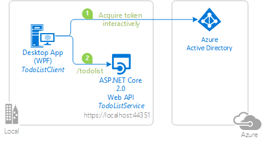
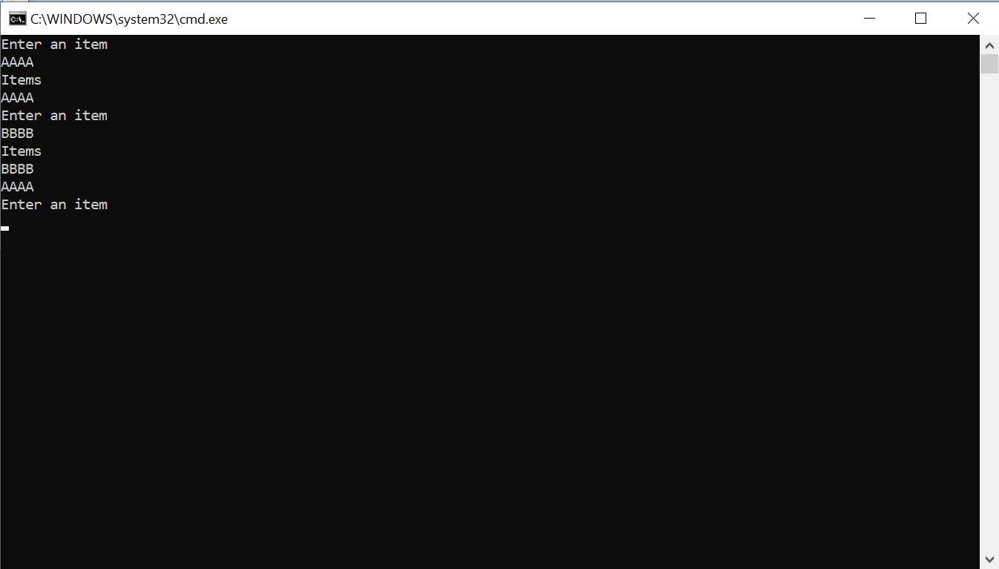

# Sign-in a user with the Microsoft Identity Platform in a console application and call an ASP.NET Core Web API using Proof of Possession token

[](https://identitydivision.visualstudio.com/IDDP/_build/latest?definitionId=516)

## About this sample

### Table of content

- [About this sample](#about-this-sample)
  - [Scenario](#scenario)
  - [Overview](#overview)
  - [User experience when using this sample](#user-experience-when-using-this-sample)
- [How to run this sample](#how-to-run-this-sample)
  - [Pre-requisites](#pre-requisites)
  - [Step 1:  Clone or download this repository](#step-1-clone-or-download-this-repository)
  - [Step 2:  Register the sample application with your Azure Active Directory tenant](#step-2-register-the-sample-application-with-your-azure-active-directory-tenant)
  - [Step 3: Run the sample](#step-3-run-the-sample)
- [How to deploy this sample to Azure](#how-to-deploy-this-sample-to-azure)
- [Community Help and Support](#community-help-and-support)
- [Contributing](#contributing)
- [More information](#more-information)

### Scenario

In this sample, we would protect an ASP.Net Core Web API using the Microsoft Identity Platform. The Web API will be protected using Azure Active Directory OAuth Bearer Authorization. The API will support authenticated users with both work and school accounts
or Microsoft personal accounts (formerly live account). The access token is protected from being replayed by enabling [Proof of possession tokens](https://tools.ietf.org/html/draft-ietf-oauth-signed-http-request-03#page-9)

### Overview

This sample presents an ASP.NET core Web API, protected by Azure AD [Proof of Possession (PoP)](https://github.com/AzureAD/azure-activedirectory-identitymodel-extensions-for-dotnet/wiki/SignedHttpRequest-aka-PoP-(Proof-of-Possession)) Authorization. The Web API is called by a .NET console application.

The .Net application uses the Microsoft Authentication Library [MSAL.NET](https://aka.ms/msal-net) to obtain a JWT [Access Token](https://docs.microsoft.com/azure/active-directory/develop/access-tokens) through the [OAuth 2.0](https://docs.microsoft.com/azure/active-directory/develop/active-directory-protocols-oauth-code) protocol. The access token is sent to the ASP.NET Core Web API, which authorizes the user using the ASP.NET JWT Bearer Authentication middleware.



 This sub-folder contains a Visual Studio solution made of two applications: the desktop application (TodoListClient), and the Web API (TodoListService).

### User experience when using this sample

The Web API (TodoListService) maintains an in-memory collection of to-do items for each authenticated user. Several applications signed-in under the same identity will share the same to-do list.

The desktop application (TodoListClient) allows a user to:

- Enter an item. When the user enters the first item, sign-in screen is displayed. The first time a user signs in, a consent screen is presented where the user consents for the application accessing the TodoList Service on their behalf.
- Each time, the user enters an item, a list of to-do items are fetched from the Web API for this signed-in identity.

Next time a user runs the application, the user is signed-in with the same identity as the console application maintains a cache on disk. Users can clear the cache (which will have the effect of them signing out).



## How to run this sample

### Pre-requisites

- This sample only works with .NET Framework (PoP is not yet implemented for .NET Core in MSAL.NET)
- An Internet connection
- A Windows machine (necessary if you want to run the app on Windows)
- An OS X machine (necessary if you want to run the app on Mac)
- A Linux machine (necessary if you want to run the app on Linux)
- An Azure Active Directory (Azure AD) tenant. For more information on how to get an Azure AD tenant, see [How to get an Azure AD tenant](https://azure.microsoft.com/documentation/articles/active-directory-howto-tenant/)
- A user account in your Azure AD tenant. This sample will not work with a Microsoft account (formerly Windows Live account). Therefore, if you signed in to the [Azure portal](https://portal.azure.com) with a Microsoft account and have never created a user account in your directory before, you need to do that now.

### Step 1:  Clone or download this repository

From your shell or command line:

```Shell
git clone https://github.com/Azure-Samples/active-directory-dotnet-native-aspnetcore-v2.git
cd "4.-Console-app-calls-web-API-with-PoP"
```

or download and extract the repository .zip file.

> Given that the name of the sample is quite long, and so are the names of the referenced NuGet packages, you might want to clone it in a folder close to the root of your hard drive, to avoid file size limitations on Windows.

### Step 2:  Register the sample application with your Azure Active Directory tenant

There are two projects in this sample. Each needs to be separately registered in your Azure AD tenant. To register these projects, you can:

- either follow the steps below for manual registration
- or use PowerShell scripts that:
  - **automatically** creates the Azure AD applications and related objects (passwords, permissions, dependencies) for you. Note that this works for Visual Studio only.
  - modify the Visual Studio projects' configuration files.

<details>
  <summary>Expand this section if you want to use this automation:</summary>

1. On Windows, run PowerShell and navigate to the root of the cloned directory
1. In PowerShell run:

   ```PowerShell
   Set-ExecutionPolicy -ExecutionPolicy RemoteSigned -Scope Process -Force
   ```

1. Run the script to create your Azure AD application and configure the code of the sample application accordingly.
1. In PowerShell run:

   ```PowerShell
   cd .\AppCreationScripts\
   .\Configure.ps1
   ```

   > Other ways of running the scripts are described in [App Creation Scripts](./AppCreationScripts/AppCreationScripts.md)
   > The scripts also provide a guide to automated application registration, configuration and removal which can help in your CI/CD scenarios.

1. Open the Visual Studio solution and click start to run the code.

</details>

Follow the steps below to manually walk through the steps to register and configure the applications.

#### Choose the Azure AD tenant where you want to create your applications

As a first step you'll need to:

1. Sign in to the [Azure portal](https://portal.azure.com) using either a work or school account or a personal Microsoft account.
1. If your account is present in more than one Azure AD tenant, select your profile at the top right corner in the menu on top of the page, and then **switch directory**.
   Change your portal session to the desired Azure AD tenant.

#### Register the service app (TodoListService (active-directory-dotnet-native-aspnetcore-v2))

1. Navigate to the Microsoft identity platform for developers [App registrations](https://go.microsoft.com/fwlink/?linkid=2083908) page.
1. Select **New registration**.
1. In the **Register an application page** that appears, enter your application's registration information:
   - In the **Name** section, enter a meaningful application name that will be displayed to users of the app, for example `TodoListService (active-directory-dotnet-native-aspnetcore-v2)`.
   - Under **Supported account types**, select **Accounts in any organizational directory and personal Microsoft accounts (e.g. Skype, Xbox, Outlook.com)**.
   - Select **Register** to create the application.
1. In the app's registration screen, find and note the **Application (client) ID**. You use this value in your app's configuration file(s) later in your code.
1. Select **Save** to save your changes.
1. In the app's registration screen, select the **Expose an API** blade to the left to open the page where you can declare the parameters to expose this app as an API for which client applications can obtain [access tokens](https://docs.microsoft.com/azure/active-directory/develop/access-tokens) for.
The first thing that we need to do is to declare the unique [resource](https://docs.microsoft.com/azure/active-directory/develop/v2-oauth2-auth-code-flow) URI that the clients will be using to obtain access tokens for this API. To declare an resource URI, follow the following steps:
   - Click `Set` next to the **Application ID URI** to generate a URI that is unique for this app.
   - For this sample, accept the proposed Application ID URI (api://{clientId}) by selecting **Save**.
1. All APIs have to publish a minimum of one [scope](https://docs.microsoft.com/azure/active-directory/develop/v2-oauth2-auth-code-flow#request-an-authorization-code) for the client's to obtain an access token successfully. To publish a scope, follow the following steps:
   - Select **Add a scope** button open the **Add a scope** screen and Enter the values as indicated below:
        - For **Scope name**, use `access_as_user`.
        - Select **Admins and users** options for **Who can consent?**
        - For **Admin consent display name** type `Access TodoListService (active-directory-dotnet-native-aspnetcore-v2)`
        - For **Admin consent description** type `Allows the app to access TodoListService (active-directory-dotnet-native-aspnetcore-v2) as the signed-in user.`
        - For **User consent display name** type `Access TodoListService (active-directory-dotnet-native-aspnetcore-v2)`
        - For **User consent description** type `Allow the application to access TodoListService (active-directory-dotnet-native-aspnetcore-v2) on your behalf.`
        - Keep **State** as **Enabled**
        - Click on the **Add scope** button on the bottom to save this scope.

#### Configure the service app (TodoListService (active-directory-dotnet-native-aspnetcore-v2)) to use your app registration

Open the project in your IDE (like Visual Studio) to configure the code.
>In the steps below, "ClientID" is the same as "Application ID" or "AppId".

1. Open the `TodoListService\appsettings.json` file
1. Find the app key `Domain` and replace the existing value with your Azure AD tenant name.
1. Find the app key `TenantId` and replace the existing value with your Azure AD tenant ID.
1. Find the app key `ClientId` and replace the existing value with the application ID (clientId) of the `TodoListService (active-directory-dotnet-native-aspnetcore-v2)` application copied from the Azure portal.

#### Register the client app (TodoListClient (active-directory-dotnet-native-aspnetcore-v2))

1. Navigate to the Microsoft identity platform for developers [App registrations](https://go.microsoft.com/fwlink/?linkid=2083908) page.
1. Select **New registration**.
1. In the **Register an application page** that appears, enter your application's registration information:
   - In the **Name** section, enter a meaningful application name that will be displayed to users of the app, for example `TodoListClient (active-directory-dotnet-native-aspnetcore-v2)`.
   - Under **Supported account types**, select **Accounts in any organizational directory and personal Microsoft accounts (e.g. Skype, Xbox, Outlook.com)**.
1. Select **Register** to create the application.
1. In the app's registration screen, find and note the **Application (client) ID**. You use this value in your app's configuration file(s) later in your code.
1. In the app's registration screen, select **Authentication** in the menu.
   - If you don't have a platform added, select **Add a platform** and select the **Public client (mobile & desktop)** option.
   - In the **Redirect URIs** | **Suggested Redirect URIs for public clients (mobile, desktop)** section, select **https://login.microsoftonline.com/common/oauth2/nativeclient**
1. Select **Save** to save your changes.
1. In the app's registration screen, click on the **API permissions** blade in the left to open the page where we add access to the Apis that your application needs.
   - Click the **Add a permission** button and then,
   - Ensure that the **My APIs** tab is selected.
   - In the list of APIs, select the API `TodoListService (active-directory-dotnet-native-aspnetcore-v2)`.
   - In the **Delegated permissions** section, select the **access_as_user** in the list. Use the search box if necessary.
   - Click on the **Add permissions** button at the bottom.

#### Configure the client app (TodoListClient (active-directory-dotnet-native-aspnetcore-v2)) to use your app registration

Open the project in your IDE (like Visual Studio) to configure the code.
>In the steps below, "ClientID" is the same as "Application ID" or "AppId".

1. Open the `TodoListClient\App.Config` file
1. Find the app key `ida:Tenant` and replace the existing value with your Azure AD tenant name.
1. Find the app key `ida:ClientId` and replace the existing value with the application ID (clientId) of the `TodoListClient (active-directory-dotnet-native-aspnetcore-v2)` application copied from the Azure portal.
1. Find the app key `todo:TodoListScope` and replace the existing value with Scope.
1. Find the app key `todo:TodoListBaseAddress` and replace the existing value with the base address of the TodoListService (active-directory-dotnet-native-aspnetcore-v2) project (by default `https://localhost:44351/`).

### Step 3: Run the sample

Clean the solution, rebuild the solution, and run it. You might want to go into the solution properties and set both projects as startup projects, with the service project starting first.

When you start the Web API from Visual Studio, depending on the browser you use, you'll get:

- an empty web page (with Microsoft Edge)
- or an error HTTP 401 (with Chrome)

This behavior is expected as the browser is not authenticated. The console application will be authenticated, so it will be able to access the Web API.

Explore the sample by signing in into the TodoList client, adding items to the To Do list, removing the user account (clearing the cache), and starting again. As explained, if you stop the application without removing the user account, the next time you run the application, you won't be prompted to sign in again. That is because the sample implements a persistent cache for MSAL, and remembers the tokens from the previous run.

NOTE: Remember, the To-Do list is stored in memory in this `TodoListService-v2` sample. Each time you run the TodoListService API, your To-Do list will get emptied.

## How was the code created

### Code for the console app

The focus of this tutorial is PoP (Proof of Possession).

With PoP, the programming model is a bit different from the way MSAL.NET usually works. A PoP token contains information about the intended URL and the HTTP verb (POST, GET). Therefore, to get a PoP token you will provide to MSAL an `HttpRequestMessage` and MSAL.NET will populate the Authorization header of this message with a PoP token.

In `Program.cs`, You'll need to:

- Instantiate a `IPublicClientApplication` specifying `WithExperimentalFeatures()`, as PoP is still an experimental feature for MSAL.NET (and implemented for only public client applications on .NET Framework).

   ```csharp
    var app = PublicClientApplicationBuilder.Create(ClientId)
        .WithAuthority(Authority)
        .WithDefaultRedirectUri()
        .WithExperimentalFeatures() // Needed for PoP
        .Build();
   ```

- Create an `HttpRequestMessage` by passing the verb (for instance `HttpMethod.Post`) and the URL of the Web API to call.
   ```csharp
    HttpRequestMessage writeRequest =
      new HttpRequestMessage(HttpMethod.Post, new Uri(TodoListApiAddress));
   ```

- Call the `AcquireTokenSilent` or `AcquireTokenInteractive`, and pass `writeRequest` parameter to `WithProofOfPossesssion` method as shown below:

```csharp
    TodoItem todoItem = ReadItemFromConsole();

    // Add Pop token to the HttpRequestMessage, attempting from the cache
    // and otherwise interactively 
    try
    {
        var account = (await app.GetAccountsAsync()).FirstOrDefault();
        result = await app.AcquireTokenSilent(Scopes, account)
                            .WithProofOfPosession(writeRequest)
                            .ExecuteAsync();   
    }
    catch (MsalUiRequiredException)
    {
        result = await app.AcquireTokenInteractive(Scopes)
                                .WithProofOfPosession(writeRequest)
                                .ExecuteAsync();
    }

    // Call the Web API
    string json = JsonConvert.SerializeObject(todoItem);
    StringContent content = new StringContent(json,
                                              Encoding.UTF8,
                                              "application/json");
    writeRequest.Content = content;
    await httpClient.SendAsync(writeRequest);
			
```

### Code for the Web API (TodoListService)

The code for the TodoListService starts in Startup.cs, where you will call `AddProofOfPosession()`

```csharp
public void ConfigureServices(IServiceCollection services)
{
    services.AddMicrosoftIdentityWebApiAuthentication(Configuration)
            .EnableTokenAcquisitionToCallDownstreamApi()
            .AddInMemoryTokenCaches();
    services.AddProofOfPosession(Configuration);
    services.AddControllers();
}
```																																										 
`AddProofOfPosession()` leverages the [SignedHttpRequest](https://github.com/AzureAD/azure-activedirectory-identitymodel-extensions-for-dotnet/wiki/SignedHttpRequest-aka-PoP-(Proof-of-Possession)) feature in `IdentityModel` (middleware library). The incoming token is handled by  `HandleAuthenticateAsync` method in  [SignedHttpRequestAuthenticationHandler.cs](https://github.com/Azure-Samples/active-directory-dotnet-native-aspnetcore-v2/blob/7d999f6180ea90171b9a90ca931a0d3de2c035f5/Microsoft.Identity.Web/SignedHttpRequest/SignedHttpRequestAuthenticationHandler.cs).

## How to deploy this sample to Azure

See [Readme.md](../5.Deploy-Web-API/README.md) to deploy this sample to Azure.
																						
## Community Help and Support

Use [Stack Overflow](http://stackoverflow.com/questions/tagged/msal) to get support from the community.
Ask your questions on Stack Overflow first and browse existing issues to see if someone has asked your question before.
Make sure that your questions or comments are tagged with [`azure-active-directory` `msal` `dotnet`].

If you find a bug in the sample, please raise the issue on [GitHub Issues](../../../issues).

To provide a recommendation, visit the following [User Voice page](https://feedback.azure.com/forums/169401-azure-active-directory).

## Contributing

If you'd like to contribute to this sample, see [CONTRIBUTING.MD](../CONTRIBUTING.md).

This project has adopted the [Microsoft Open Source Code of Conduct](https://opensource.microsoft.com/codeofconduct/). For more information, see the [Code of Conduct FAQ](https://opensource.microsoft.com/codeofconduct/faq/) or contact [opencode@microsoft.com](mailto:opencode@microsoft.com) with any additional questions or comments.

## More information

For more information, visit the following links:

- To lean more about the application registration, visit:

  - [Quickstart: Register an application with the Microsoft identity platform (Preview)](https://docs.microsoft.com/azure/active-directory/develop/quickstart-register-app)
  - [Quickstart: Configure a client application to access web APIs (Preview)](https://docs.microsoft.com/azure/active-directory/develop/quickstart-configure-app-access-web-apis)
  - [Quickstart: Quickstart: Configure an application to expose web APIs (Preview)](https://docs.microsoft.com/azure/active-directory/develop/quickstart-configure-app-expose-web-apis)

- To learn more about ASP.NET Core Web APIs: see [Introduction to Identity on ASP.NET Core](https://docs.microsoft.com/aspnet/core/security/authentication/identity?view=aspnetcore-2.1&tabs=visual-studio%2Caspnetcore2x) and also:
  - [AuthenticationBuilder](https://docs.microsoft.com/dotnet/api/microsoft.aspnetcore.authentication.authenticationbuilder?view=aspnetcore-2.0)
  - [Azure Active Directory with ASP.NET Core](https://docs.microsoft.com/aspnet/core/security/authentication/azure-active-directory/?view=aspnetcore-2.1)
