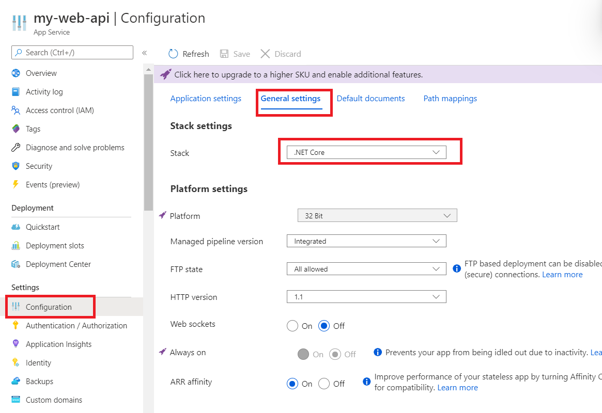
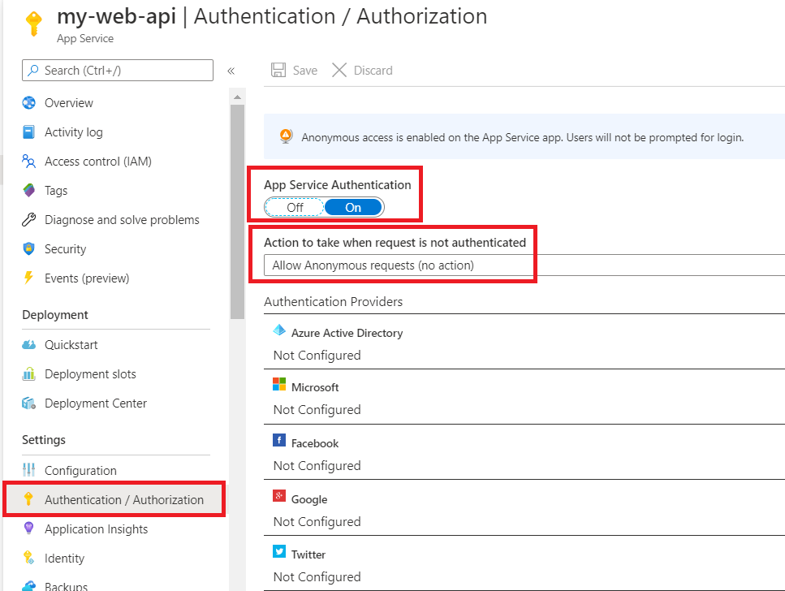

# Deploying a protected ASP.NET Core web API and calls the API from Desktop application

In this guide, we will deploy our project component, **TodoListService** to **Azure App Services**.

## Table of Content

- [Table of Content](#table-of-content)
- [Prerequisites](#prerequisites)
- [Deployment](#deployment)
  - [Publish the Web API](#publish-the-web-api)
  - [Configure the Web API](#configure-the-web-api)
  - [Disabling Microsoft Entra authentication](#disabling-azure-ad-authentication)
  - [Modify app.config](#modify-appconfig)
- [Discussion](#discussion)
- [Known Issues](#known-issues)
- [More information](#more-information)
- [Code of Conduct](#code-of-conduct)

## Prerequisites

- [Visual Studio 2019](https://aka.ms/vsdownload) or the [.NET Core SDK](https://www.microsoft.com/net/learn/get-started) and [VS Code](https://code.visualstudio.com/download).
- An **Azure subscription**. This sample uses **Azure App Services**.
- We recommend [Azure Tools for VS Code Extension](https://marketplace.visualstudio.com/items?itemName=ms-vscode.vscode-node-azure-pack) for interacting with Azure services directly within VS Code.
  
## Deployment

We will deploy our web API on [Azure App Services](https://azure.microsoft.com/services/app-service/).

### Publish the Web API

There are two ways to publish the app:
- Publish using Visual Studio
- Publish using Visual Studio Code

#### Publish using Visual Studio

Follow the instructions at [Publish a Web app to Azure App Service using Visual Studio](https://docs.microsoft.com/en-US/visualstudio/deployment/quickstart-deploy-to-azure?view=vs-2019#:~:text=%20Publish%20to%20Azure%20App%20Service%20%201,Service%2C%20and%20the%20web%20app%20loads...%20More%20).

#### Publish using Visual Studio Code

Using a command line interface such as VS Code integrated terminal, follow the documentation [Publish an ASP.NET Core app to Azure with Visual Studio Code](https://docs.microsoft.com/en-us/aspnet/core/tutorials/publish-to-azure-webapp-using-vscode?view=aspnetcore-3.1#:~:text=Publish%20to%20Azure%20App%20Service.%20Leveraging%20the%20Azure,the%20Web%20App%3B%20Select%20Create%20New%20Web%20App).

### Configure the Web API

On the **App Services** portal, click on the **Configuration** blade and set the **stack** property to **.NET Core**.



### Disabling Microsoft Entra authentication

Still on the **App Services** portal, click on the **Authentication/Authorization** blade. There, make sure that the **App Services Authentication** is switched off (and nothing else is checked), as we are using our own authentication logic.  



### Modify app.config

1. Open the `TodoListClient\app.config` file
2. Find the key `todo:TodoListBaseAddress` and replace the existing value with the **Resource Uri** that you've just obtained in deploying TodoListService on **App Service** (e.g. https://my-web-api.azurewebsites.net/).
3. Re-build and run your client application.

## Discussion

Here we discuss some of the more important aspects of deploying multi-tenant application suites.

## Known Issues

- In case you receive the `HTTP Error 500.30 - ANCM In-Process Start Failure` error for your Web API on **Azure App Services**, try adding this line to `TodoListService/TodoListService.csproj` and re-deploy your project:

 ```xml
    <PropertyGroup>
        <TargetFramework>netcoreapp3.1</TargetFramework>
        <UserSecretsId>aspnet-TodoListService-BA938C29-8BAB-4664-A688-8FD54049C1C3</UserSecretsId>
        <WebProject_DirectoryAccessLevelKey>1</WebProject_DirectoryAccessLevelKey>
        <AspNetCoreHostingModel>OutOfProcess</AspNetCoreHostingModel> // Add this line
    </PropertyGroup>
 ```

> [!NOTE] Did the sample not work for you as expected? Did you encounter issues trying this sample? Then please reach out to us using the [GitHub Issues](../../../issues) page.

> [Consider taking a moment to share your experience with us.](https://forms.office.com/Pages/ResponsePage.aspx?id=v4j5cvGGr0GRqy180BHbR73pcsbpbxNJuZCMKN0lURpUNDVNMlg5UlVWVDlVNFhJMUZFRlNEMU5LRiQlQCN0PWcu)

## More information

- [Quickstart: Create an ASP.NET Core web app in Azure](https://docs.microsoft.com/azure/app-service/app-service-web-get-started-dotnet)
- [Tutorial: Authenticate and authorize users end-to-end in Azure App Service](https://docs.microsoft.com/azure/app-service/app-service-web-tutorial-auth-Microsoft Entra ID)
- [Authentication and authorization in Azure App Service and Azure Functions](https://docs.microsoft.com/azure/app-service/overview-authentication-authorization)
- [Configure your App Service or Azure Functions app to use Microsoft Entra login](https://docs.microsoft.com/azure/app-service/configure-authentication-provider-Microsoft Entra ID)

## Code of Conduct

This project has adopted the [Microsoft Open Source Code of Conduct](https://opensource.microsoft.com/codeofconduct/).
For more information see the [Code of Conduct FAQ](https://opensource.microsoft.com/codeofconduct/faq/) or
contact [opencode@microsoft.com](mailto:opencode@microsoft.com) with any additional questions or comments.
