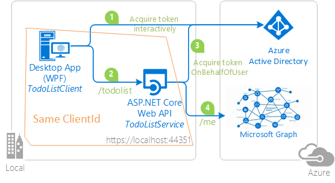

---
languages:
  - csharp
products:
  - aspnet
  - azure
page_type: sample
urlFragment: active-directory-dotnet-native-aspnetcore-v2
description: "Protect an ASP.NET Core Web API with the Microsoft identity platform."
---
# Protecting an ASP.NET Core Web API using Microsoft identity platform

[](https://identitydivision.visualstudio.com/IDDP/_build/latest?definitionId=516)

## About this sample

### Scenario

In this scenario, we protect a web API using the Microsoft identity platform. This ensures that the web API is accessible only to authenticated users. In these samples, we work with apps that authenticate users using both **Work and school accounts** and personal **Microsoft accounts (MSA)**.

We also enhance the web API to use the [on-behalf-of flow](https://docs.microsoft.com/azure/active-directory/develop/v2-oauth2-on-behalf-of-flow) to call other web APIs protected by the Microsoft identity platform.

### Prerequisites

- Install .NET Core for Windows by following the instructions at [dot.net/core](https://dot.net/core) which includes [Visual Studio 2019](https://aka.ms/vsdownload).
- a Microsoft Entra tenant. For more information on how to get a Microsoft Entra tenant, see [Quickstart: Set up a tenant](https://docs.microsoft.com/azure/active-directory/develop/quickstart-create-new-tenant)
- A user account in your Microsoft Entra tenant, or a personal Microsoft account (MSA)

### Step 1:  Clone or download this repository

From your shell or command line:

```Shell
git clone https://github.com/Azure-Samples/active-directory-dotnet-native-aspnetcore-v2.git
```

> TIP: To avoid path length limitations on Windows, you may need to clone into a directory with a shorter name or near the root of your drive.

### Structure of the repository

This repository contains a progressive tutorial made up of the following chapters. We recommend you follow the tutorial in the order presented, but you can try out individual chapters if you wish.

| Subfolder | Description |
|--|--|
| [1. Desktop app calls a protected Web API](https://docs.microsoft.com/samples/azure-samples/active-directory-dotnet-native-aspnetcore-v2/1-desktop-app-calls-web-api/) | In the first chapter, we protect an ASP.Net Core Web API using the Microsoft identity platform. The Web API will be protected using Microsoft Entra ID OAuth Bearer Authorization. The Web API is called by a .NET Desktop WPF application. In this chapter, the desktop application uses the [Microsoft Authentication Library for .NET (MSAL.NET)](https://aka.ms/msal-net) to sign-in the user to acquire an [Access Token](https://docs.microsoft.com/azure/active-directory/develop/access-tokens) for the protected Web API. </p>  |
| [2. Web API now calls Microsoft Graph](https://docs.microsoft.com/samples/azure-samples/active-directory-dotnet-native-aspnetcore-v2/2-web-api-now-calls-microsoft-graph/) | In the second chapter we enhance the Web API to call Microsoft Graph using the on-behalf flow to represent the user signed-in in the desktop application to Microsoft Graph. In this chapter, the Web API uses the [MSAL.NET](https://aka.ms/msal-net) to acquire an [Access Token](https://docs.microsoft.com/azure/active-directory/develop/access-tokens) for Microsoft Graph using the [on-behalf-of](https://aka.ms/msal-net-on-behalf-of) flow </p>   |
| [3. Web API and client share the same app id and signs-in MSA users](https://docs.microsoft.com/samples/azure-samples/active-directory-dotnet-native-aspnetcore-v2/3-web-api-call-microsoft-graph-for-personal-accounts/) | In the third chapter, we present another pattern where a tightly-knit client and Web API share the same client id (app id). In this one we will  sign-in users with Microsoft Personal Accounts. The sign-in flow and the call to Web API uses the same flow as chapter 2. </p>   |
| [4. Client app calls a Web API with Proof of Possession (PoP)](https://docs.microsoft.com/samples/azure-samples/active-directory-dotnet-native-aspnetcore-v2/4-console-app-calls-web-api-with-pop/) | In this chapter, the ASP.NET Core Web API is expecting an [Access Token](https://docs.microsoft.com/azure/active-directory/develop/access-tokens) with a Proof of Possession key. </p>  |

We recommend that you start with chapter [1. Desktop app calls Web API](1.%20Desktop%20app%20calls%20Web%20API/README-incremental.md), where you learn how to protect a web API with Microsoft Entra ID.

## Community Help and Support

Use [Stack Overflow](http://stackoverflow.com/questions/tagged/msal) to get support from the community.
Ask your questions on Stack Overflow first and browse existing issues to see if someone has asked your question before.
Tag your questions or comments with [`msal` `dotnet`].

If you find a bug in the sample, please open an issue on [GitHub Issues](https://github.com/Azure-Samples/active-directory-dotnet-native-aspnetcore-v2/issues).

To provide a recommendation, visit the following [User Voice page](https://feedback.azure.com/forums/169401-azure-active-directory).

## Contributing

If you'd like to contribute to this sample, see [CONTRIBUTING.MD](/CONTRIBUTING.md).

This project has adopted the [Microsoft Open Source Code of Conduct](https://opensource.microsoft.com/codeofconduct/). For more information, see the [Code of Conduct FAQ](https://opensource.microsoft.com/codeofconduct/faq/) or contact [opencode@microsoft.com](mailto:opencode@microsoft.com) with any additional questions or comments.

## Other samples and documentation

See also other samples where a client app calls your own web API:
- [Sample: ASP.NET Core web app calling your own web API](https://github.com/Azure-Samples/active-directory-aspnetcore-webapp-openidconnect-v2/tree/master/4-WebApp-your-API)
- [Sample: .NET Core Daemon application calling your own web API](https://github.com/Azure-Samples/active-directory-dotnetcore-daemon-v2/tree/master/2-Call-OwnApi)
- [Sample: Angular application calling your own web API](https://github.com/Azure-Samples/ms-identity-javascript-angular-spa-aspnetcore-webapi)

Then for other samples and docs:
- Other samples for Microsoft identity platform are available from [https://aka.ms/aaddevsamplesv2](https://aka.ms/aaddevsamplesv2).
- The conceptual documentation for MSAL.NET is available from [https://aka.ms/msalnet](https://aka.ms/msalnet).
- The documentation for identity platform is available from [https://aka.ms/aadv2](https://aka.ms/aadv2).
